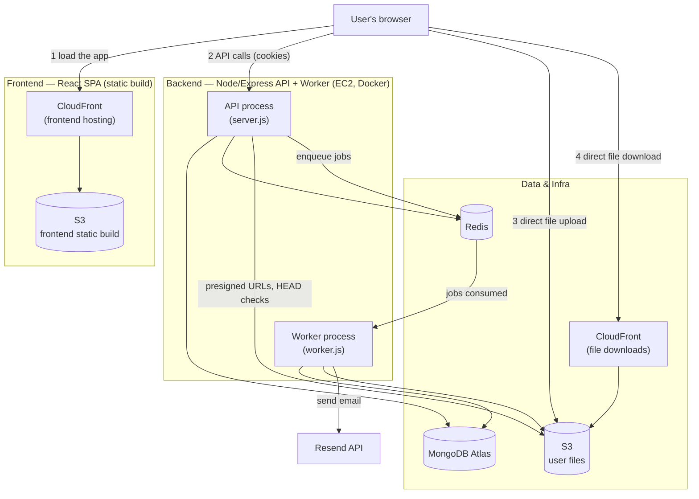
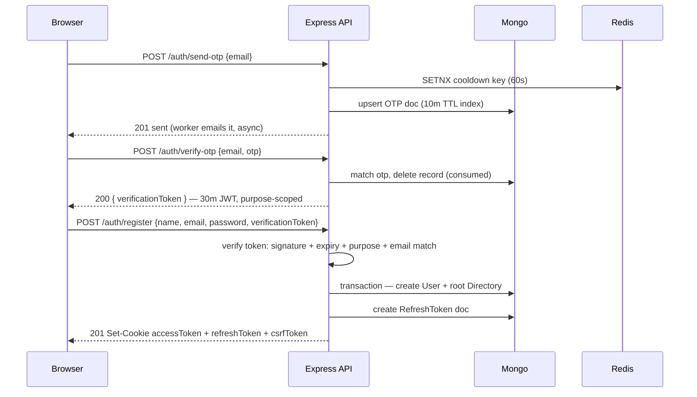
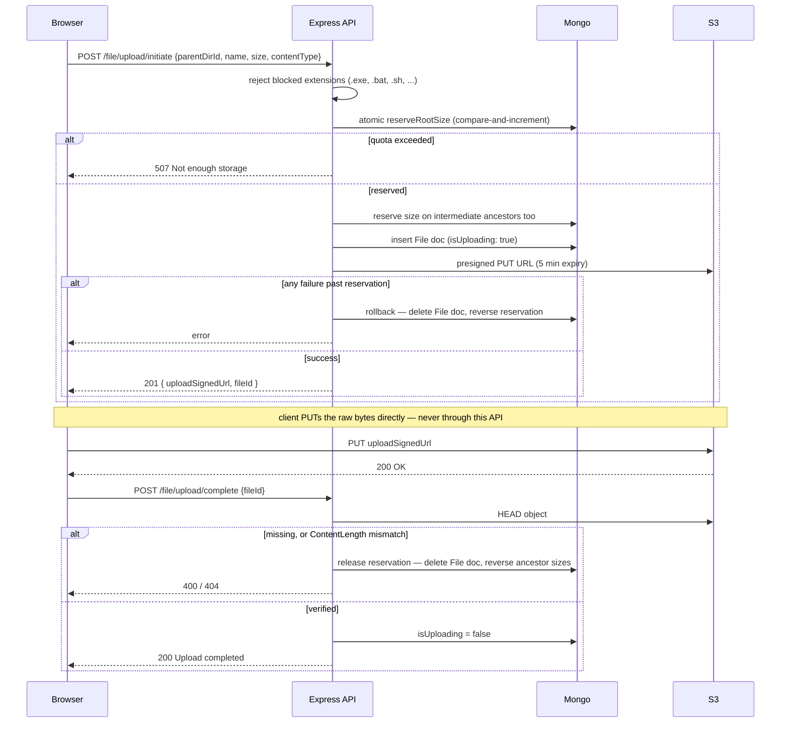
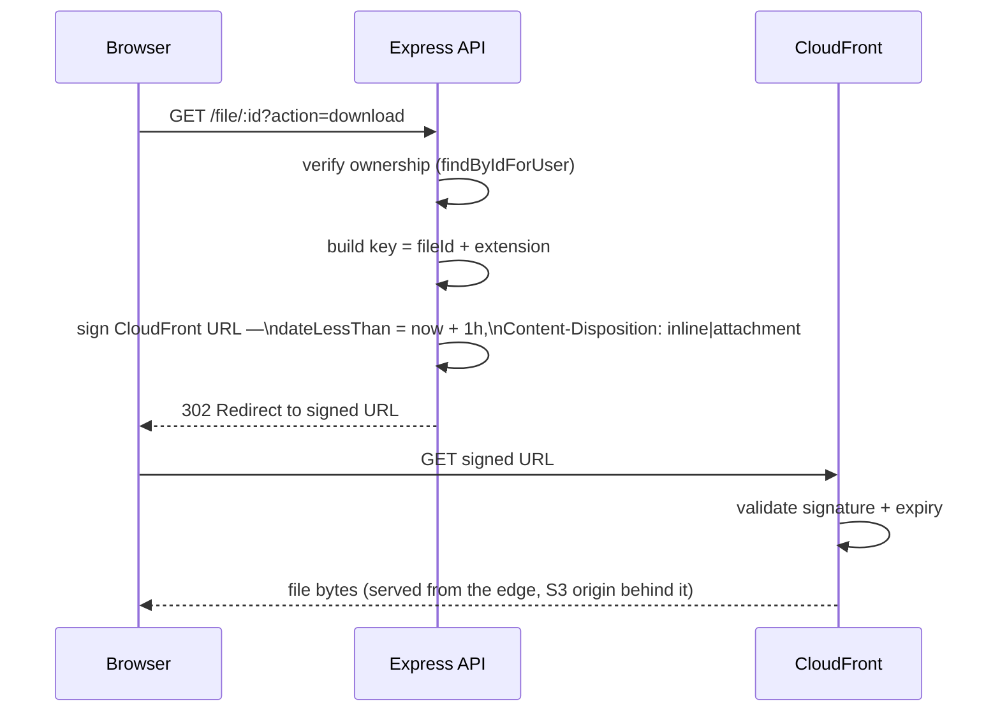
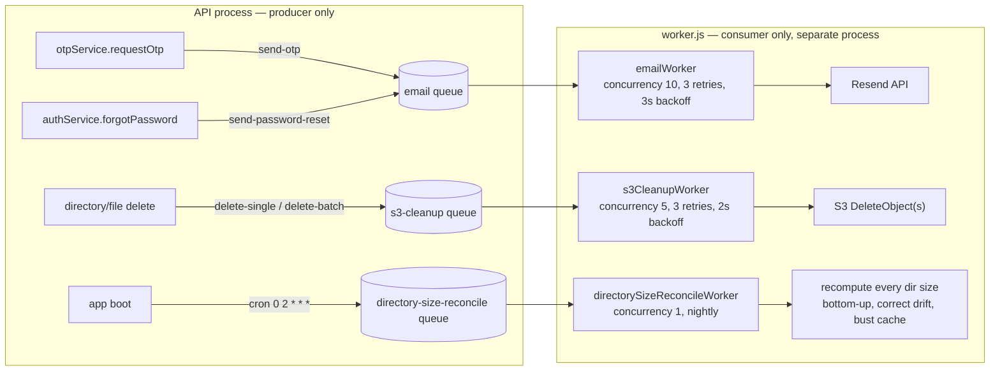
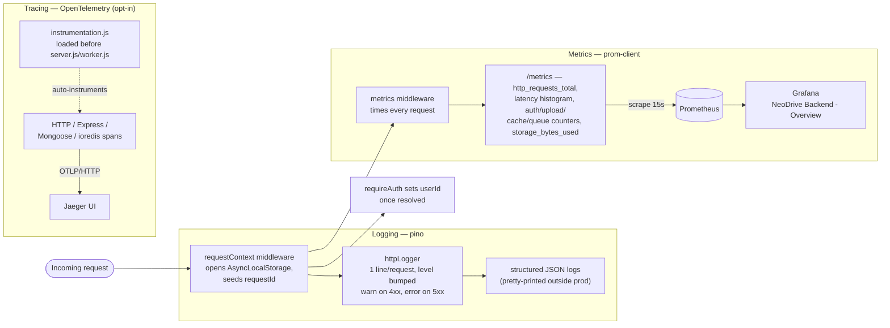
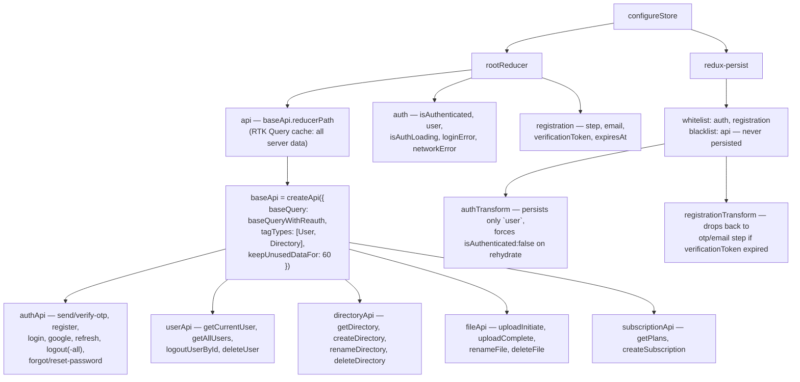
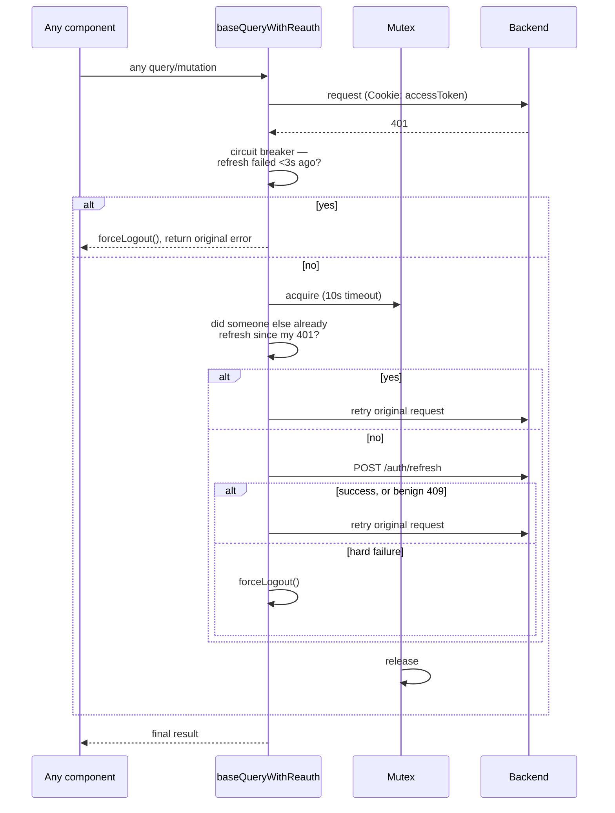
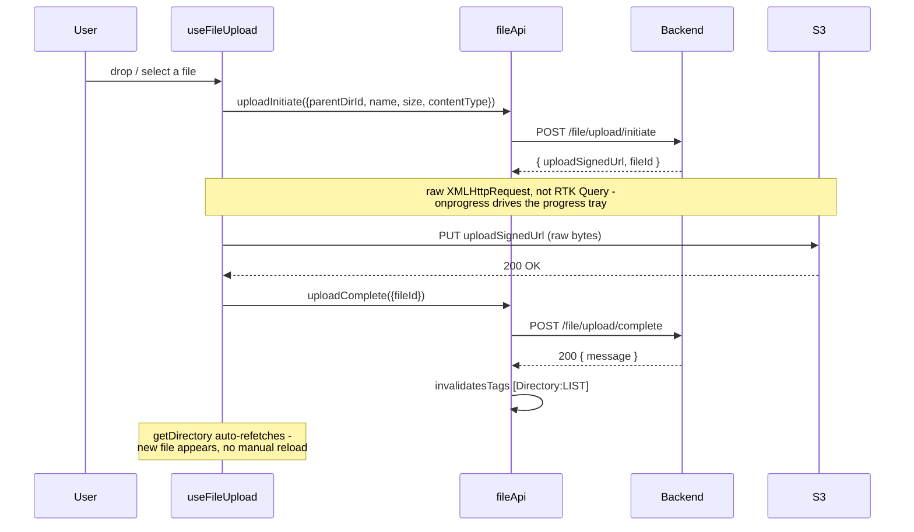
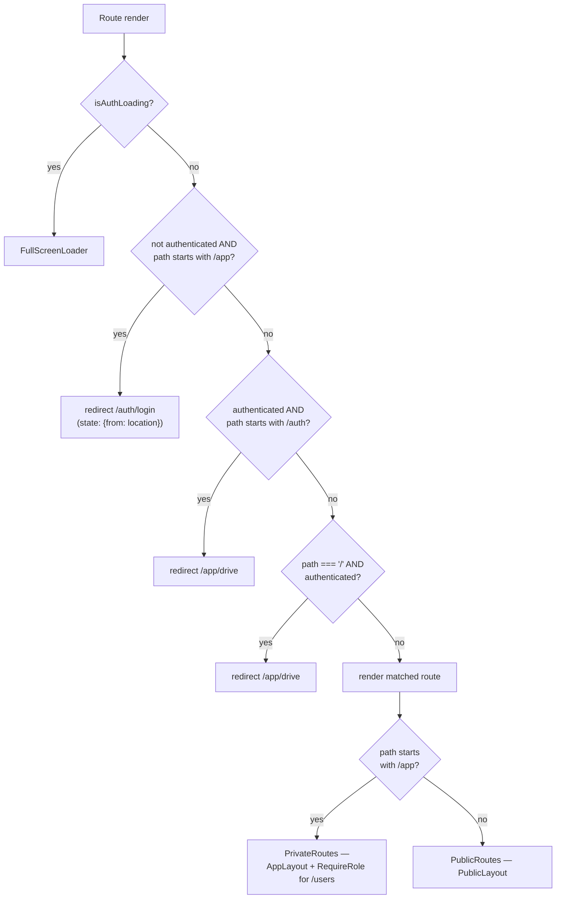

# NeoDrive

A Google-Drive-style file storage app — React frontend, Node/Express backend, direct-to-S3
uploads, CloudFront-signed downloads, MongoDB Atlas, Redis, and BullMQ background jobs. This is
a two-package monorepo: [`backend/`](./backend) and [`frontend/`](./frontend) each have their own
README, docs, and deployment path — this file is the map between them.

## How it fits together



Two separate S3/CloudFront pairs, on purpose: one hosts the frontend's static build, the other
stores and serves user files. Neither the frontend's static assets nor a user's uploaded files
ever pass through the API server itself — steps 1, 3, and 4 above go straight to S3/CloudFront;
only step 2 (actual API calls — auth, directory/file metadata, presigned-URL requests) hits the
backend.

This is the *runtime* picture. For the full request-by-request detail — auth, directory/file
operations, signed URLs, caching, queues on the backend; bootstrap, the Redux/RTK Query store,
routing, upload on the frontend — see each package's own **Flow Diagrams**, linked below.

---

## Backend

Node/Express API: dual-JWT cookie auth with refresh rotation and reuse detection, RBAC, a
directory/file tree with atomic quota reservation, two-phase S3 uploads, CloudFront-signed
downloads, Redis cache-aside, BullMQ background jobs (email, S3 cleanup, nightly size
reconciliation), and a full observability stack (pino, Prometheus, OpenTelemetry).

- **[backend/README.md](./backend/README.md)** — setup, scripts, architecture summary, and the
  backend's own embedded **[Flow Diagrams](./backend/README.md#flow-diagrams)**
- **[backend/docs/index.md](./backend/docs/index.md)** — one doc per feature: auth, users,
  directories, files, subscriptions/webhooks, background jobs, caching, security, observability,
  error handling, plus a flat [API reference](./backend/docs/api-reference.md)
- **[backend/docs/flow-diagrams.md](./backend/docs/flow-diagrams.md)** ·
  [Artifact ↗](https://claude.ai/code/artifact/d2fad691-e000-4b18-9463-b81fb05db9f9)
- Deployment: [EC2 + Docker + nginx + Let's Encrypt](./backend/docs/ec2-deployment.md)

```bash
cd backend
npm install
cp .env.example .env   # fill in secrets, including a MongoDB Atlas DB_URL
npm run dev:all         # Redis (Docker) + migrations + API + worker, one command, hot reload
```

### Backend flow diagrams (preview)

Five of the nine diagrams from [backend/README.md#flow-diagrams](./backend/README.md#flow-diagrams) —
click to expand. The full set (request lifecycle, login, refresh rotation, directories, caching)
plus a timeouts cheat-sheet is there.

<details>
<summary><strong>Auth — registration (OTP → verification token → account)</strong></summary>

The verification token exists specifically so a page reload between steps 2 and 3 doesn't force
the user through a brand new OTP email.



</details>

<details>
<summary><strong>File upload — two-phase commit</strong></summary>

Quota is reserved at *initiate*, not at *complete* — an abandoned upload still counts against
quota until explicitly deleted.



</details>

<details>
<summary><strong>File download — signed URL generation</strong></summary>

The API never streams file bytes — it only ever hands out a time-limited pointer. `action`
controls inline vs. forced download; nothing else about the URL changes.



</details>

<details>
<summary><strong>Background queues</strong></summary>

If the worker process isn't running, jobs pile up in Redis and nothing happens — OTP/reset emails
never send, deleted files' S3 objects never get cleaned up — even though the API endpoints that
enqueued them already returned success.



</details>

<details>
<summary><strong>Observability — logs, metrics, traces</strong></summary>

Every log line auto-carries `requestId`/`userId`/`traceId` via `AsyncLocalStorage` — no value is
threaded manually through service calls. Tracing is fully opt-in: nothing starts unless
`OTEL_EXPORTER_OTLP_ENDPOINT` is set.



</details>

## Frontend

React 19 + Redux Toolkit/RTK Query client: cookie-based auth (no client-readable token
anywhere), a from-scratch UI component library on Tailwind CSS v4, a 3-step signup wizard that
survives a page reload, direct-to-S3 upload with progress, and a multi-provider analytics module.

- **[frontend/README.md](./frontend/README.md)** — setup, scripts, stack summary, and the
  frontend's own embedded **[Flow Diagrams](./frontend/README.md#flow-diagrams)**
- **[frontend/docs/index.md](./frontend/docs/index.md)** — one doc per concern: auth, routing,
  state/API, file management, analytics, styling, environment variables, build & deploy,
  contributing
- **[frontend/docs/flow-diagrams.md](./frontend/docs/flow-diagrams.md)** ·
  [Artifact ↗](https://claude.ai/code/artifact/1482b2f2-a52d-410f-a2eb-e3ff7a039c15)
- Deployment: [S3 + CloudFront + ACM + GitHub Actions](./frontend/docs/s3-cloudfront-deployment.md)

```bash
cd frontend
npm install
cp .env.example .env.local   # fill in VITE_API_BASE_URL etc.
npm run dev                   # http://localhost:5173
```

### Frontend flow diagrams (preview)

Four of the eleven diagrams from [frontend/README.md#flow-diagrams](./frontend/README.md#flow-diagrams) —
click to expand. The full set (bootstrap, registration, session-guard logout, directory browsing,
analytics) plus a config/timeouts cheat-sheet is there.

<details>
<summary><strong>Redux store & RTK Query architecture</strong></summary>

One `createApi()` instance, five feature files injecting into it — not five separate APIs. That's
why they all share one cache, one tag list, and the same reauth logic.



</details>

<details>
<summary><strong>Auth — token refresh & reauth (client-side)</strong></summary>

The post-acquire "did someone else already refresh" check and the 409-as-success handling are
both fixes for a real race that used to cause a burst of redundant refresh calls.



</details>

<details>
<summary><strong>File upload — two-phase commit (client side)</strong></summary>



</details>

<details>
<summary><strong>Routing — AuthGuard decision tree</strong></summary>



</details>

Run both at once (two terminals): backend's `npm run dev:all` in `backend/`, frontend's
`npm run dev` in `frontend/` — the frontend expects the backend at `http://localhost:4000` by
default.

---

## Deployment

Each package deploys independently, to different infrastructure, via its own GitHub Actions
workflow — both live at the repo root (`.github/workflows/`, the only place GitHub Actions looks)
and are scoped with an `on.push.paths` filter so a change to one package never triggers the
other's pipeline:

| | Backend | Frontend |
|---|---|---|
| Target | EC2 (Docker Compose) | S3 (private, OAC) + CloudFront |
| Workflow | `.github/workflows/deploy-backend.yml` | `.github/workflows/deploy-frontend.yml` |
| Triggers on | `backend/**` | `frontend/**` |
| Guide | [backend/docs/ec2-deployment.md](./backend/docs/ec2-deployment.md) | [frontend/docs/s3-cloudfront-deployment.md](./frontend/docs/s3-cloudfront-deployment.md) |

See [frontend/docs/build-and-deploy.md#how-two-workflows-share-one-repo](./frontend/docs/build-and-deploy.md#how-two-workflows-share-one-repo)
for exactly how the path-filtering works.

## Full stack locally, via Docker

```bash
npm run docker:up      # first run / after a backend code change - rebuilds the image
npm run docker:start   # subsequent runs
npm run docker:down    # stop everything
```

This is a thin root-level wrapper (`docker-compose.yml` → `include:` → `backend/docker-compose.yml`)
— it brings up the backend's API/worker/Redis/observability stack (MongoDB is Atlas, not
containerized). The frontend isn't part of this — run it separately with `npm run dev` in
`frontend/`, or build+deploy it to S3/CloudFront per the guide above.
