# NeoDrive Backend (v2)

Production-grade rebuild of the storage app API: file/folder storage backed by S3 +
CloudFront, MongoDB, Redis, BullMQ background jobs, and a full observability stack
(structured logs, Prometheus metrics, OpenTelemetry tracing).

**Looking for API request/response payloads, or a deep dive into how a specific feature works?**
See **[docs/](./docs/index.md)** — one doc per feature (auth, users, directories, files, sharing,
subscriptions/webhooks, background jobs, caching, security, observability, error handling) plus a
flat [API reference](./docs/api-reference.md) of every route.

**New to this codebase?** Jump to **[Flow Diagrams](#flow-diagrams)** below — rendered inline,
click any section to expand — or read the prose version with a full timeouts/expiry cheat-sheet
at [docs/flow-diagrams.md](./docs/flow-diagrams.md).

## Architecture

Layered, capstone-style: `routes -> controllers -> services -> repositories -> models`.
Repositories are the only layer that touches Mongoose; services are plain exported
functions (no classes, no DI container - imports are the wiring).

- **Auth**: dual JWT (access + refresh) with rotation-and-reuse-detection, Redis-backed
  access-token blacklist, RBAC, account lockout, purpose-scoped tokens for password
  reset. See `src/services/auth.service.js` and `src/services/token.service.js`.
- **Storage**: S3 presigned uploads + CloudFront signed downloads (`src/services/storage/`).
- **Folder download**: a whole folder (owner's own, or a shared one) as a `.zip` — the one read
  path where the API server actually streams file bytes itself, rather than redirecting to
  CloudFront (`directoryService.buildDirectoryZip`, reused by both `/directory/:id/download` and
  the public `/s/:token/download`).
- **Sharing**: read-only link sharing for a file or folder (with drill-down); `/share` manages
  links (auth required), `/s` resolves them — the one fully public, unauthenticated data
  endpoint in the API (`src/services/share.service.js`).
- **Caching**: cache-aside for user profile and directory listings, fail-open on Redis
  errors (`src/services/cache.service.js`).
- **Background jobs**: BullMQ queues for S3 cleanup, email sending, and nightly
  directory-size reconciliation (`src/queues/`). Run via `npm run worker`.
- **Observability**: pino structured logs with request/trace correlation, Prometheus
  metrics at `/metrics`, OpenTelemetry tracing (opt-in via `OTEL_EXPORTER_OTLP_ENDPOINT`),
  `/healthz` + `/readyz`.

## Setup

```bash
npm install
cp .env.example .env   # fill in secrets, including a MongoDB Atlas DB_URL
npm run dev:all         # starts Redis (Docker), runs migrations, then API + worker together
```

`dev:all` is the fast day-to-day loop — one command, hot reload on both the API and the worker,
no Docker rebuild. See **[docs/local-dev-troubleshooting.md](./docs/local-dev-troubleshooting.md)**
for what it does under the hood, how to run the pieces separately instead, and a full
error-message-to-fix table.

MongoDB must run as a replica set - `register`/Google-login use a transaction. A MongoDB Atlas
cluster (the default `DB_URL` in `.env.example`) already satisfies this out of the box.

## Full stack (API + worker + Redis + Prometheus + Grafana + Jaeger)

MongoDB is not containerized - `DB_URL` in `.env` points at your MongoDB Atlas cluster.

```bash
npm run docker:up      # first run / after code changes - rebuilds the images
npm run docker:start   # subsequent runs - skips the rebuild, starts in ~2s
npm run docker:logs    # tail app + worker
npm run docker:down    # stop everything
```

- API: http://localhost:4000
- Prometheus: http://localhost:9090
- Grafana: http://localhost:3001 (anonymous viewer access)
- Jaeger UI: http://localhost:16686

See **[docs/installation.md](./docs/installation.md)** for the full walkthrough (env setup, startup order, verification checklist), **[docs/frontend-integration-guide.md](./docs/frontend-integration-guide.md)** if you're building a frontend against this API from scratch, or **[docs/ec2-deployment.md](./docs/ec2-deployment.md)** to deploy this to a real EC2 instance with nginx, TLS, and CI/CD.

## Scripts

| Script                                                         | Purpose                                                                                      |
| -------------------------------------------------------------- | -------------------------------------------------------------------------------------------- |
| `npm run dev:all`                                            | Redis (Docker) + migrations + API + worker, all in one command, hot reload on both processes |
| `npm run dev`                                                | API with hot reload (on its own)                                                             |
| `npm run worker:dev`                                         | Background worker with hot reload (on its own)                                               |
| `npm run migrate:up` / `migrate:down` / `migrate:status` | MongoDB index migrations (migrate-mongo)                                                     |
| `npm run format`                                             | Prettier                                                                                     |

## Security notes

- Every secret/identifier is env-driven (`src/config/env.js`) - nothing hardcoded.
- CSRF: signed double-submit cookie, enforced on cookie-authenticated mutating routes
  only (Bearer-token requests are exempt, since they carry no ambient cookie).
- Rate limiting, Helmet, Mongo sanitization, and HPP are applied globally in `app.js`.

## Flow Diagrams

Click a section to expand. Full prose + a one-page timeouts/expiry cheat-sheet:
[docs/flow-diagrams.md](./docs/flow-diagrams.md). Polished standalone version (same diagrams,
sidebar navigation): [Artifact ↗](https://claude.ai/code/artifact/d2fad691-e000-4b18-9463-b81fb05db9f9).
Client-side counterpart — bootstrap, Redux/RTK Query, auth, routing, upload — in
[../frontend/README.md#flow-diagrams](../frontend/README.md#flow-diagrams).

<details>
<summary><strong>1. System overview</strong></summary>

The API process only ever *enqueues* background work — it never sends an email, deletes an S3
object, or recomputes directory sizes itself. That happens in `worker.js`, a second process
reading the same Redis queues.

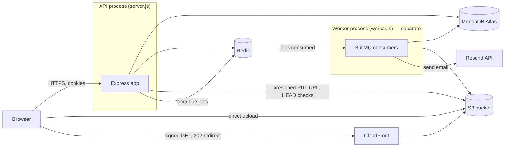

</details>

<details>
<summary><strong>2. Request lifecycle</strong></summary>

Every request, in order, per `app.js`. Webhooks split off *before* JSON parsing specifically so
Razorpay's signature check gets the exact raw bytes.

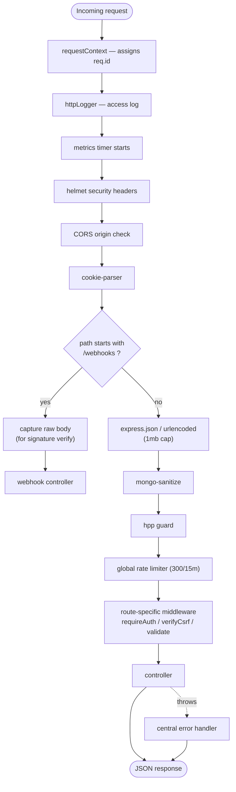

</details>

<details>
<summary><strong>3. Auth — registration (OTP → verification token → account)</strong></summary>

The verification token exists specifically so a page reload between steps 2 and 3 doesn't force
the user through a brand new OTP email.

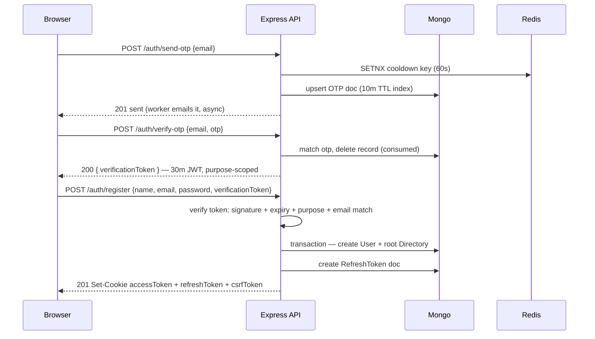

</details>

<details>
<summary><strong>3b. Auth — login</strong></summary>

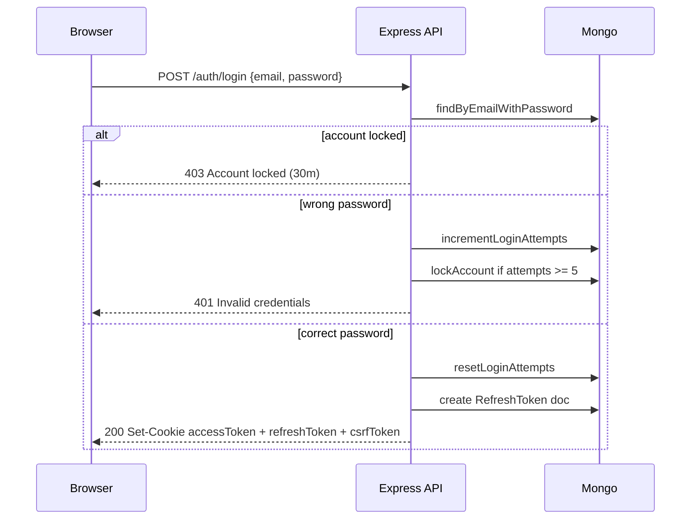

</details>

<details>
<summary><strong>4. Auth — every subsequent request (requireAuth)</strong></summary>

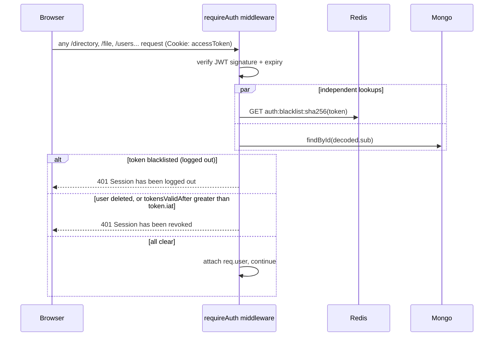

</details>

<details>
<summary><strong>4b. Auth — refresh rotation (with reuse/theft detection)</strong></summary>

A 3-second window is what separates a benign concurrent-request race from genuine token theft —
`REFRESH_RACE_GRACE_MS`.

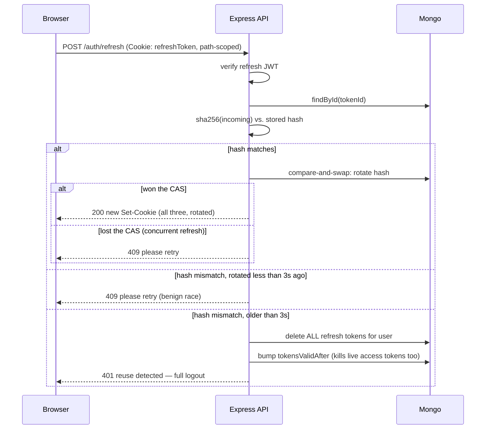

</details>

<details>
<summary><strong>5. Directory flow</strong></summary>

S3 objects are deleted *asynchronously* via the `s3-cleanup` queue — the directory disappears
from the API instantly, the underlying objects shortly after.

```mermaid
flowchart TD
    subgraph GET["GET /directory/:id?"]
        G1{"Redis dir_listing\ncache hit? (45s TTL)"}
        G1 -->|yes| G2["return cached listing"]
        G1 -->|no| G3["query Mongo: dir + files\n+ children + ancestors"]
        G3 --> G4["write to Redis, 45s TTL"]
        G4 --> G5["return fresh listing"]
    end

    subgraph CREATE["POST /directory/:parentId?"]
        C1{"caller owns\nparent dir?"}
        C1 -->|no| C2["404"]
        C1 -->|yes| C3["insert Directory doc\n(name via dirname header)"]
        C3 --> C4["invalidate cache: parent listing"]
    end

    subgraph DELETE["DELETE /directory/:id"]
        D1{"is caller's\nroot dir?"}
        D1 -->|yes| D2["400 cannot delete root"]
        D1 -->|no| D3["recursively collect every\ndescendant file + dir"]
        D3 --> D4["parallel: enqueue S3 cleanup +\ndelete File docs + delete Directory docs"]
        D4 --> D5["decrement size up ancestor chain"]
        D5 --> D6["invalidate cache: every touched ancestor"]
    end
```

</details>

<details>
<summary><strong>5b. Directory download — streaming a zip of the whole subtree</strong></summary>

The one download path where the API server actually reads file bytes — every other download is
a CloudFront redirect. Files are fetched from S3 one at a time, not all at once.

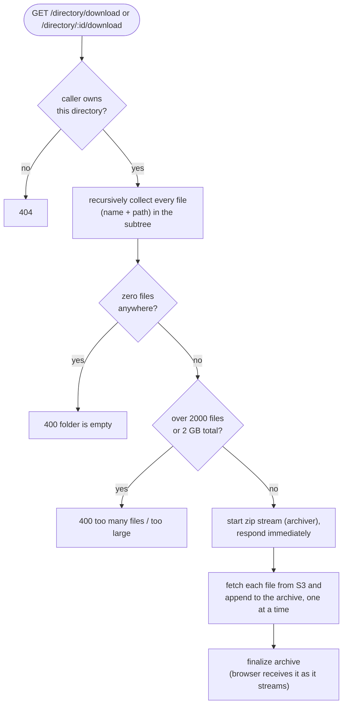

</details>

<details>
<summary><strong>6. File upload — two-phase commit</strong></summary>

Quota is reserved at *initiate*, not at *complete* — an abandoned upload still counts against
quota until explicitly deleted.

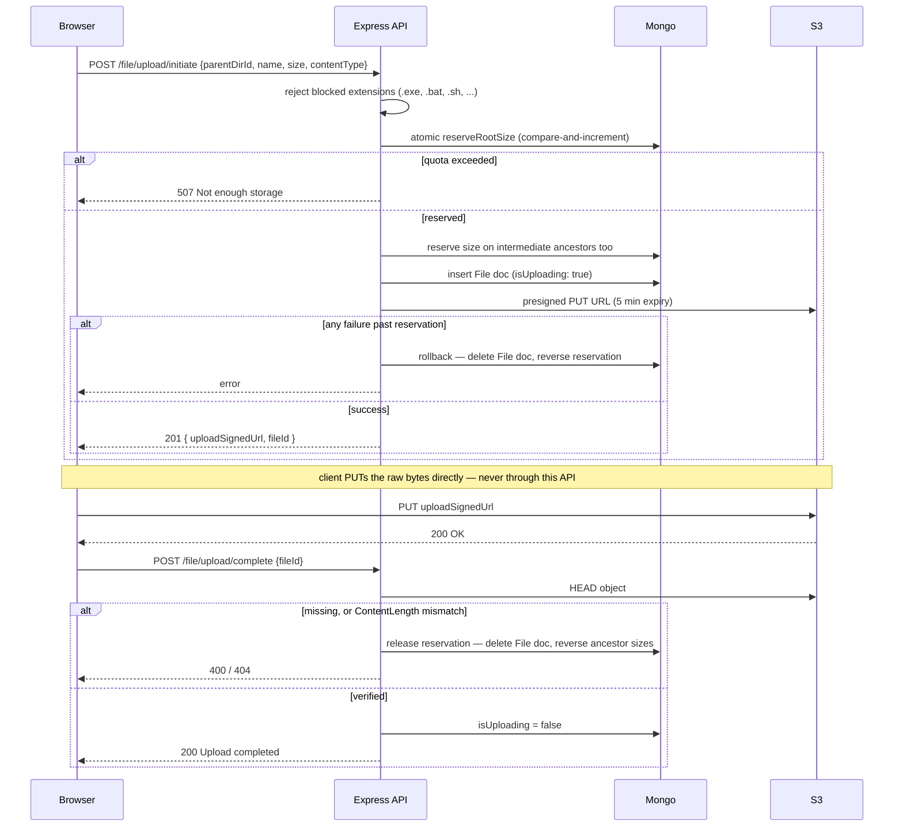

</details>

<details>
<summary><strong>7. File download — signed URL generation</strong></summary>

The API never streams file bytes — it only ever hands out a time-limited pointer. `action`
controls inline vs. forced download; nothing else about the URL changes.

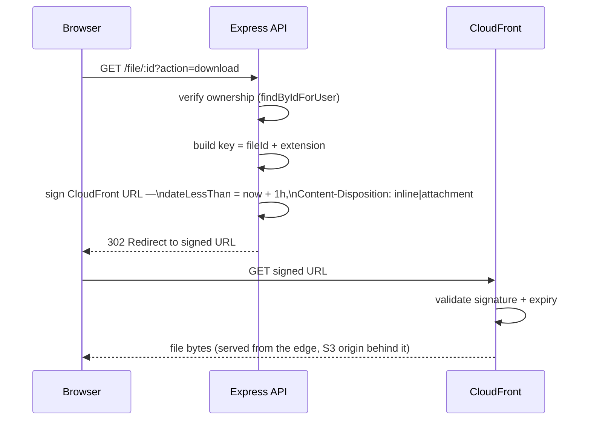

</details>

<details>
<summary><strong>7b. Sharing — create a link, then an anonymous visitor resolves and downloads it</strong></summary>

Read-only link sharing for a file or a folder (with drill-down). `/share` (create/list/revoke)
requires the normal session; `/s` (resolve/download) requires nothing at all — the one public
data-fetching surface in the API.

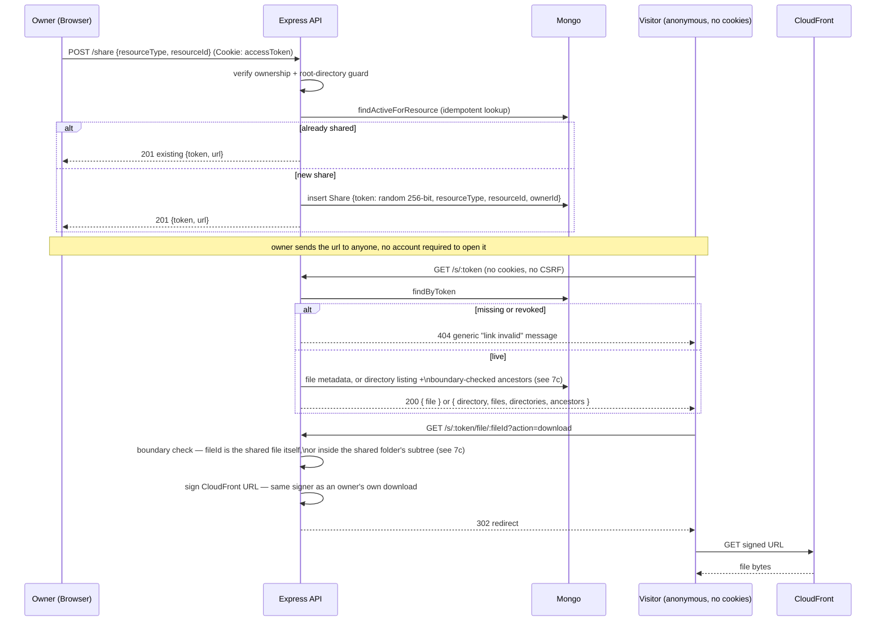

Revoking takes effect on the very next `GET /s/:token` — no cache in front of this lookup.

</details>

<details>
<summary><strong>7c. Sharing — the folder-boundary security check</strong></summary>

A visitor can browse anywhere inside a shared folder, and nowhere else. Applied identically to
`?dirId=` on resolution and to `:fileId` on download.

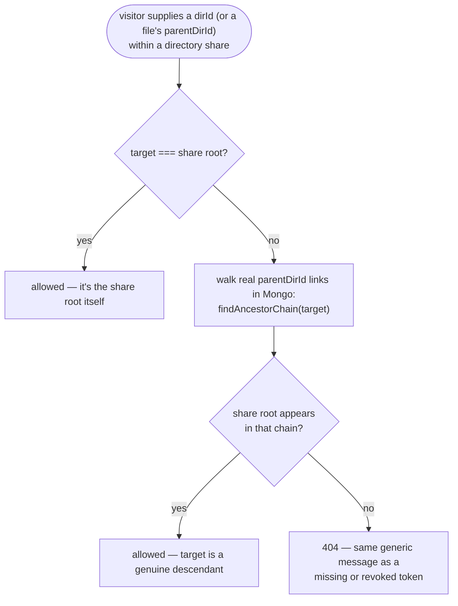

</details>

<details>
<summary><strong>8. Caching — where it comes in</strong></summary>

Two caches: `user_profile` (`user:profile:<userId>`, 300s TTL, populated by `GET /users/me`) and
`dir_listing` (`dir:listing:<userId>:<dirId>`, 45s TTL, populated by `GET /directory/:id?`). Any
Redis error, on either side, is logged and swallowed — an outage degrades to "always hit Mongo,"
never a 500.

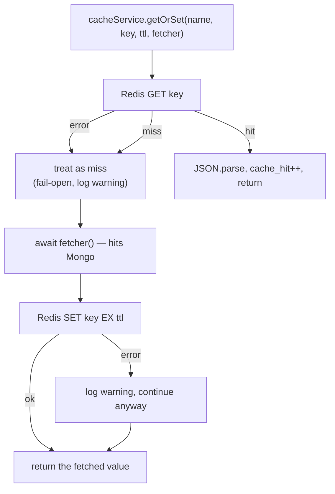

</details>

<details>
<summary><strong>9. Background queues</strong></summary>

If the worker process isn't running, jobs pile up in Redis and nothing happens — OTP/reset emails
never send, deleted files' S3 objects never get cleaned up — even though the API endpoints that
enqueued them already returned success.

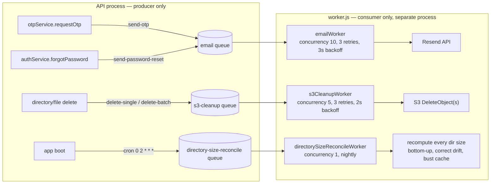

</details>

Full timeouts/expiry cheat-sheet (access token, refresh token, OTP, signed URLs, caches, rate
limits — everything above, in one table): [docs/flow-diagrams.md#10-timeouts--expiry-cheat-sheet](./docs/flow-diagrams.md#10-timeouts--expiry-cheat-sheet).
