# Flow Diagrams

Visual reference for how a request actually moves through this backend — end to end, from the
middleware pipeline through auth, directories, files, signed URLs, caching, and the background
queues. This doc is diagram-first; for full payloads and edge cases, follow the links out to the
relevant deep-dive doc. A rendered, navigable version of this same content is also published as
an Artifact.

Every diagram here was checked directly against the source it describes:
`app.js`, `src/middlewares/auth.middleware.js`, `src/services/auth.service.js`,
`src/services/directory.service.js` (incl. `prepareDirectoryZip`), `src/services/file.service.js`,
`src/services/share.service.js`, `src/services/storage/{s3,cloudfront}.storage.js`,
`src/services/cache.service.js`, `src/queues/*`.

---

## 1. System overview

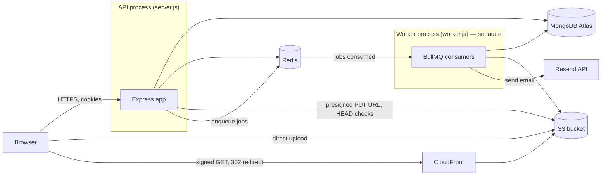

The API process only ever **enqueues** background work — it never sends an email, deletes an S3
object, or recomputes directory sizes itself. That all happens in `worker.js`, a second Node
process reading the same Redis queues. See [background-jobs.md](./background-jobs.md).

---

## 2. Request lifecycle (every request, in order)

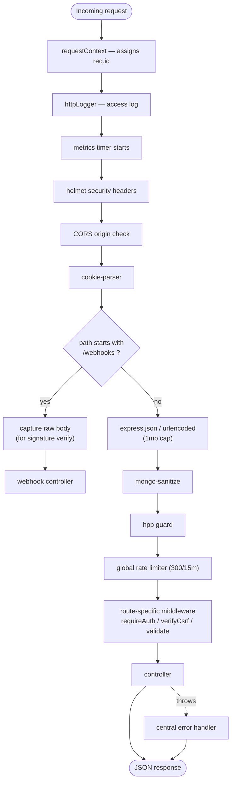

Webhooks are split off **before** JSON parsing specifically so Razorpay's signature check gets
the exact raw bytes — see [subscriptions-billing.md](./subscriptions-billing.md).

---

## 3. Auth — registration (OTP → verification token → account)

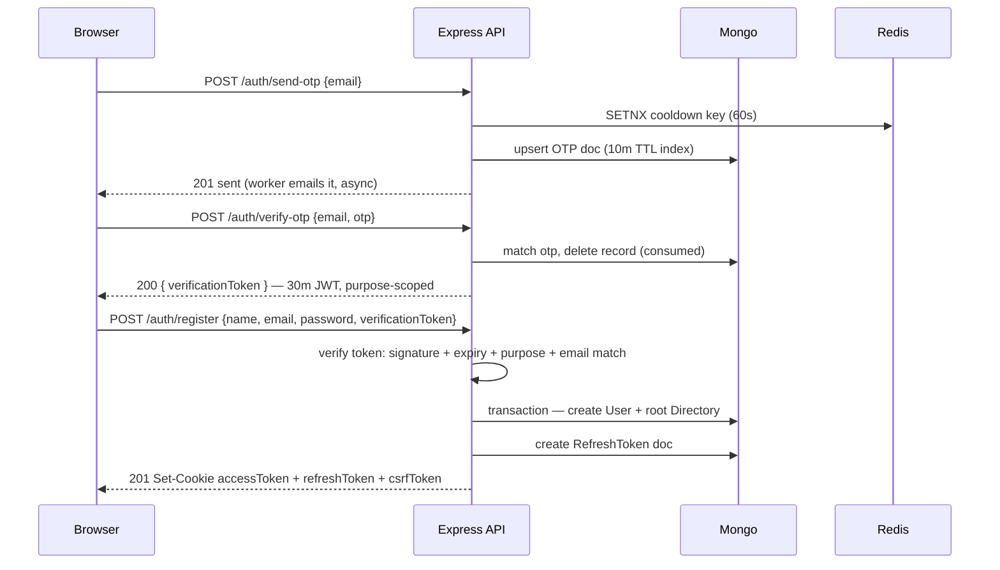

The verification token exists specifically so a page reload between steps 2 and 3 doesn't force
the user through a brand new OTP email — see
[authentication.md](./authentication.md#post-authverify-otp).

## 3b. Auth — login

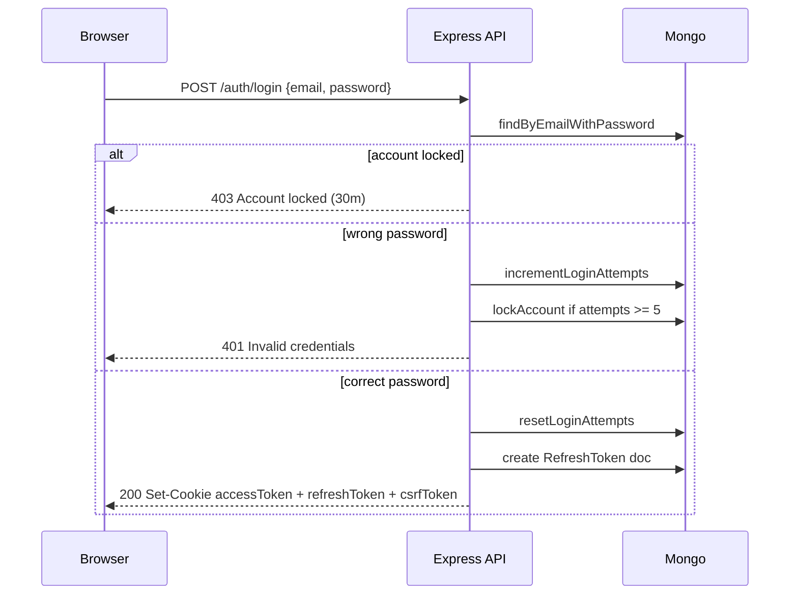

---

## 4. Auth — every subsequent request (`requireAuth`)

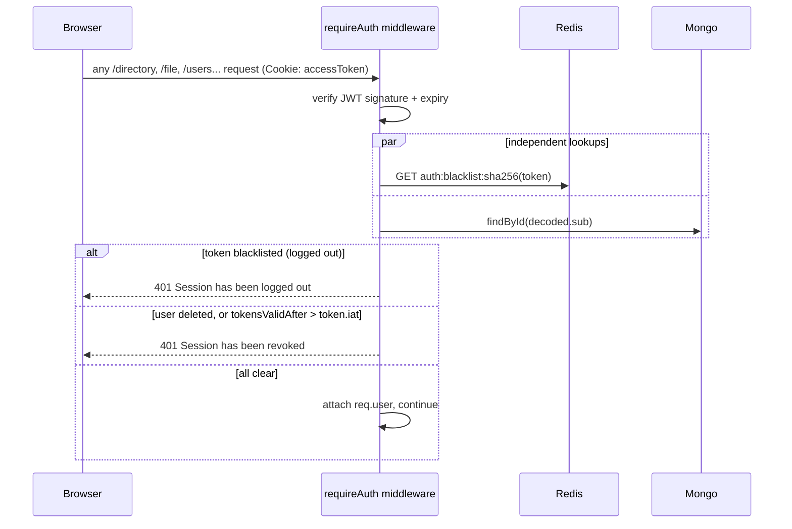

## 4b. Auth — refresh rotation (with reuse/theft detection)

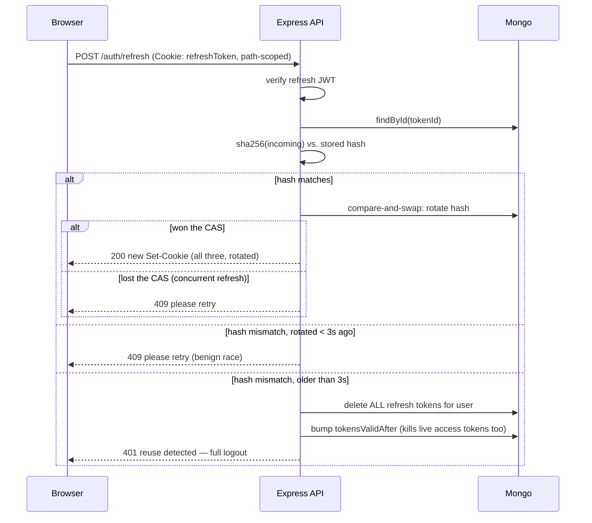

Full detail on why a 3-second window separates a benign race from theft:
[authentication.md](./authentication.md#post-authrefresh).

---

## 5. Directory flow

```mermaid
flowchart TD
    subgraph GET["GET /directory/:id?"]
        G1{"Redis dir_listing\ncache hit? (45s TTL)"}
        G1 -->|yes| G2["return cached listing"]
        G1 -->|no| G3["query Mongo: dir + files\n+ children + ancestors"]
        G3 --> G4["write to Redis, 45s TTL"]
        G4 --> G5["return fresh listing"]
    end

    subgraph CREATE["POST /directory/:parentId?"]
        C1{"caller owns\nparent dir?"}
        C1 -->|no| C2["404"]
        C1 -->|yes| C3["insert Directory doc\n(name via dirname header)"]
        C3 --> C4["invalidate cache: parent listing"]
    end

    subgraph DELETE["DELETE /directory/:id"]
        D1{"is caller's\nroot dir?"}
        D1 -->|yes| D2["400 cannot delete root"]
        D1 -->|no| D3["recursively collect every\ndescendant file + dir"]
        D3 --> D4["parallel: enqueue S3 cleanup +\ndelete File docs + delete Directory docs"]
        D4 --> D5["decrement size up ancestor chain"]
        D5 --> D6["invalidate cache: every touched ancestor"]
    end
```

S3 objects are deleted **asynchronously** via the `s3-cleanup` queue — the directory disappears
from the API instantly, the underlying objects shortly after. See
[directories.md](./directories.md).

---

## 5b. Directory download — streaming a zip of the whole subtree

The one download path in the app where the API server actually reads file bytes — every other
download is a CloudFront redirect (see 7, 7b below).

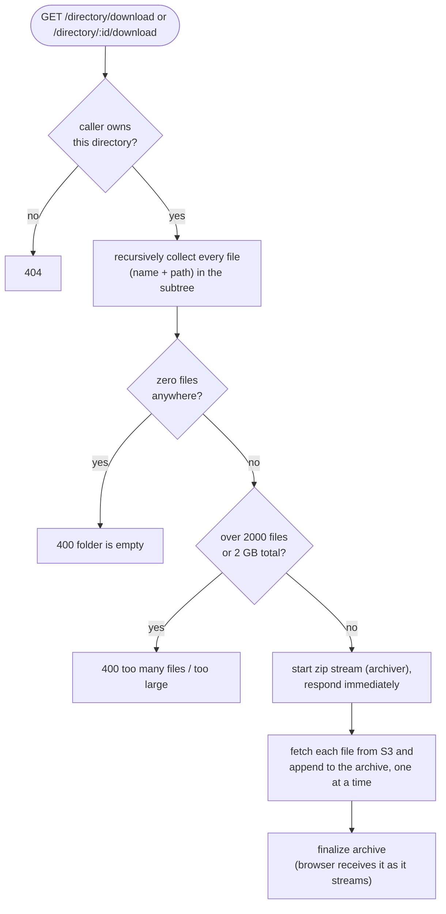

Files are fetched from S3 **sequentially**, not all at once — keeps at most one S3 read stream
open at a time rather than racing to open hundreds. Rate-limited tighter than other downloads
(`directoryDownloadLimiter`, 10/min/user) for the same reason. See
[directories.md](./directories.md#get-directorydownload-and-get-directoryiddownload).

---

## 6. File upload — two-phase commit

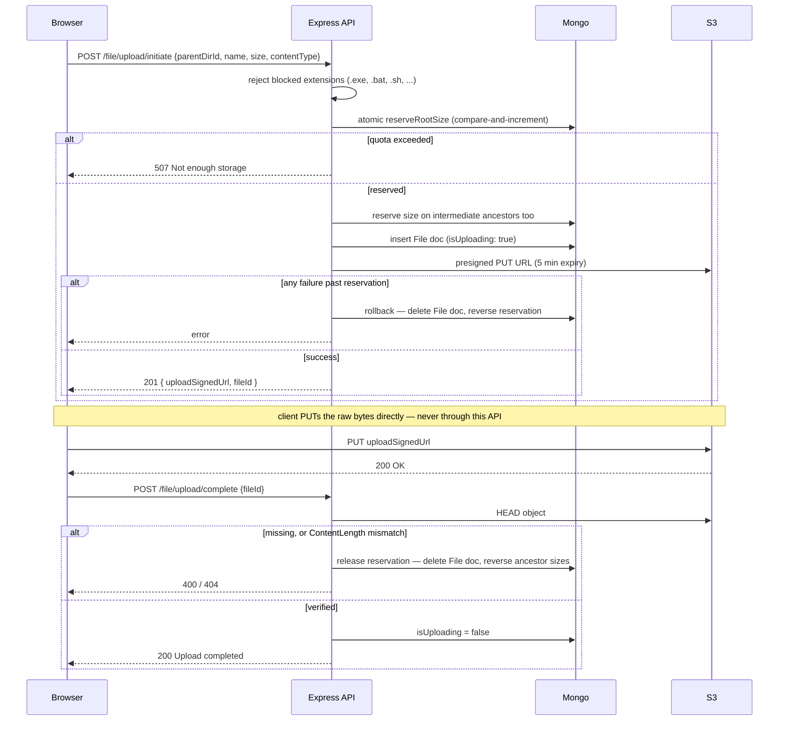

Quota is reserved at **initiate**, not at **complete** — an abandoned upload (never completed)
still counts against quota until explicitly deleted. See
[files.md](./files.md#post-fileuploadinitiate).

---

## 7. File download — signed URL generation

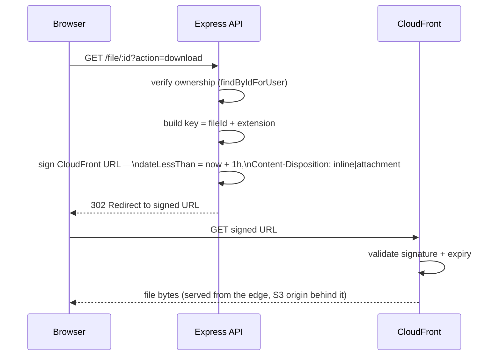

The API never streams file bytes — it only ever hands out a time-limited pointer. `action`
controls whether the browser renders it inline or forces a download; nothing else about the URL
changes. See [files.md](./files.md#get-fileidactiondownload).

---

## 7b. Sharing — create a link, then an anonymous visitor resolves and downloads it

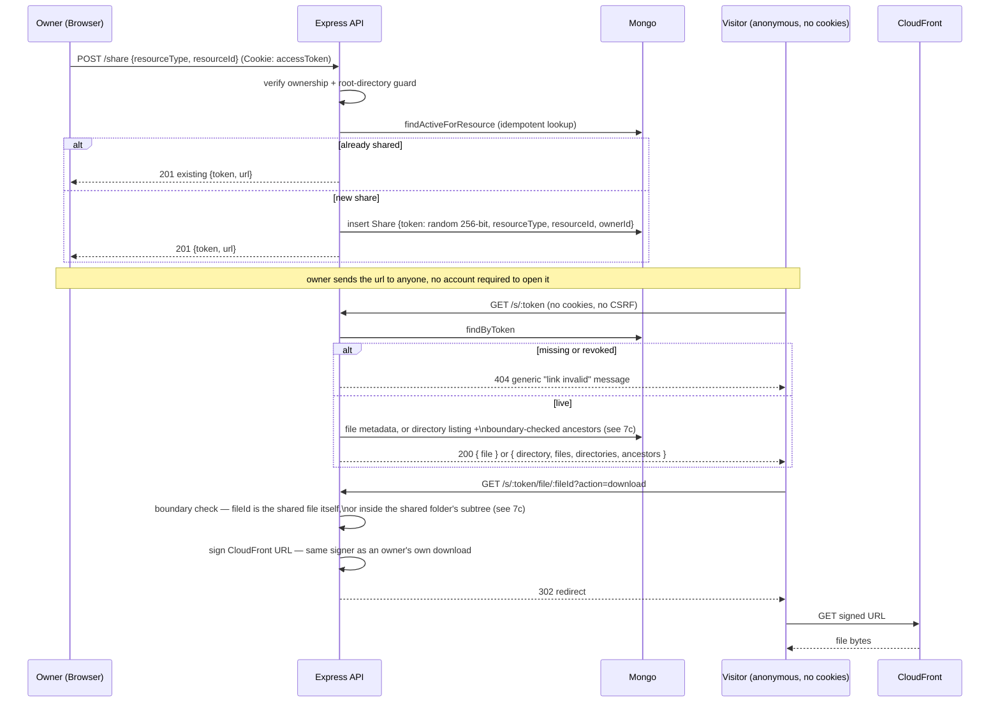

Revoking (`DELETE /share/:id`) takes effect on the very next `GET /s/:token` — there's no cache in
front of this lookup, deliberately (see [caching.md](./caching.md) and
[sharing.md](./sharing.md#caching)). See [sharing.md](./sharing.md) for the full endpoint
reference.

---

## 7c. Sharing — the folder-boundary security check

The one property a folder share depends on: a visitor can browse anywhere *inside* the shared
folder, and nowhere else. Applied identically to `?dirId=` on `GET /s/:token` and to `:fileId` on
the download endpoint (via the file's `parentDirId`):

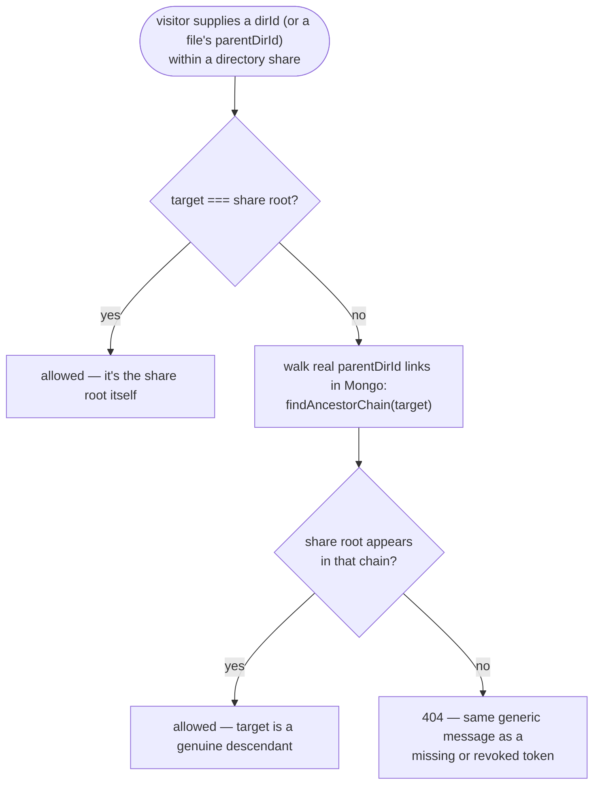

Because the chain is walked from real `parentDirId` links stored in Mongo — never trusted from
anything the client sends — there is no `dirId`/`fileId` a visitor can construct that passes this
check without the resource actually living inside the shared folder. See
[sharing.md](./sharing.md#the-security-boundary-check).

---

## 8. Caching — where it comes in

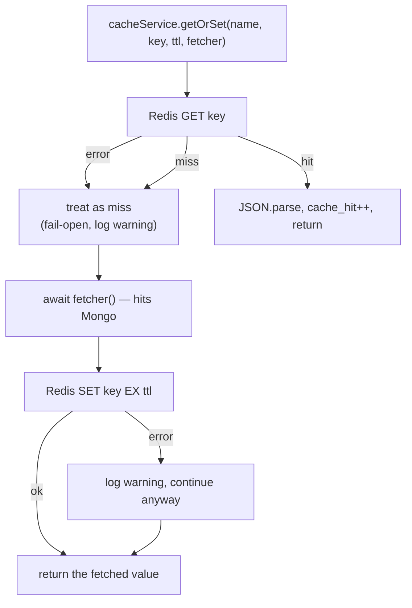

**The two caches in use:**

| Cache | Key | TTL | Populated by |
|---|---|---|---|
| `user_profile` | `user:profile:<userId>` | 300s | `GET /users/me` |
| `dir_listing` | `dir:listing:<userId>:<dirId>` | 45s | `GET /directory/:id?` |

**What invalidates them:** every directory/file create, rename, or delete calls
`invalidateDirectoryListings` for every ancestor whose `size` it touched — not just the target —
since a listing embeds its own directory's `size`. The nightly reconciliation job does the same
for anything it corrects. `user_profile` is only busted on user delete or a subscription webhook
quota change. Any Redis error, on either the read or write side, is logged and swallowed — a
Redis outage degrades the app to "always hit Mongo," never a 500. See
[caching.md](./caching.md).

---

## 9. Background queues

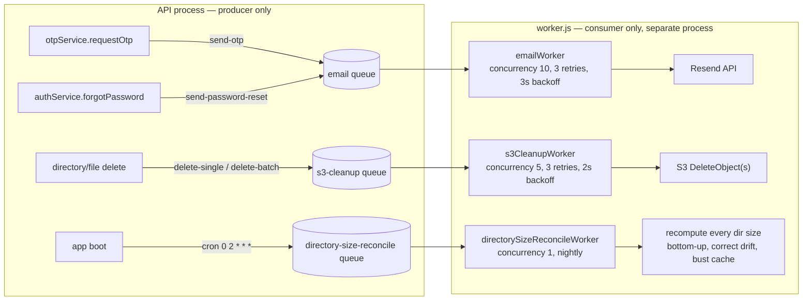

If the worker process isn't running, jobs pile up in Redis and nothing happens — OTP/reset emails
never send, deleted files' S3 objects never get cleaned up — even though the API endpoints that
enqueued them already returned success. See [background-jobs.md](./background-jobs.md).

---

## 10. Timeouts & expiry — cheat sheet

| What | Value | Source |
|---|---|---|
| Access token | 15m | `ACCESS_TOKEN_EXPIRY` |
| Refresh token | 30d | `REFRESH_TOKEN_EXPIRY` |
| Refresh rotation race grace window | 3s | `REFRESH_RACE_GRACE_MS` (hardcoded) |
| OTP validity | 10m (Mongo TTL index) | `OTP_TTL_SECONDS` |
| OTP resend cooldown | 60s | `OTP_RESEND_COOLDOWN_SECONDS` |
| OTP max verify attempts | 5 | `OTP_MAX_VERIFY_ATTEMPTS` |
| Email-verification token | 30m | `EMAIL_VERIFICATION_TOKEN_EXPIRY` |
| Password-reset token | 15m | `PASSWORD_RESET_TOKEN_EXPIRY` |
| Account lockout | 30m, after 5 failed attempts | `LOCK_DURATION_MS` / `MAX_LOGIN_ATTEMPTS` |
| Max concurrent sessions/user | 5 (oldest evicted) | `MAX_SESSIONS_PER_USER` |
| S3 upload presigned URL | 5m | hardcoded, `s3.storage.js` |
| CloudFront download signed URL | 1h | `CLOUDFRONT_URL_EXPIRY_SECONDS` |
| `user_profile` cache | 5m | `PROFILE_CACHE_TTL_SECONDS` |
| `dir_listing` cache | 45s | `DIR_LISTING_CACHE_TTL_SECONDS` |
| Access-token blacklist entry | = token's remaining life at logout | `token.service.js` |
| Global rate limit | 300 / 15m per IP | `globalLimiter` |
| Auth rate limit (OTP/login/register/...) | 10 / 15m per `ip:email` | `authLimiter` |
| Refresh rate limit | 120 / 15m per IP | `refreshLimiter` |
| Upload rate limit | 60 / min per user | `uploadLimiter` |
| Directory zip download rate limit | 10 / min per user | `directoryDownloadLimiter` |
| Directory zip download limits | 2000 files, 2 GB total | hardcoded, `directory.service.js` |
| Share-create rate limit | 20 / min per user | `shareCreateLimiter` |
| Share-resolve rate limit (public `/s/*`) | 300 / 15m per IP | `shareResolveLimiter` |
| Share link lifetime | none — revoke-only, no expiry (v1) | [sharing.md](./sharing.md) |
| Share download signed URL | 5 min (shorter than the owner default above on purpose) | `shareSignedUrlExpirySeconds` / `SHARE_DOWNLOAD_URL_EXPIRY_SECONDS` — see [sharing.md](./sharing.md#revocation-vs-an-already-issued-download-link) for why revoke can't retroactively kill an already-issued one |
| Nightly size reconciliation | 02:00 daily | cron `0 2 * * *` |

See [security.md](./security.md) for the reasoning behind each auth-related number.
