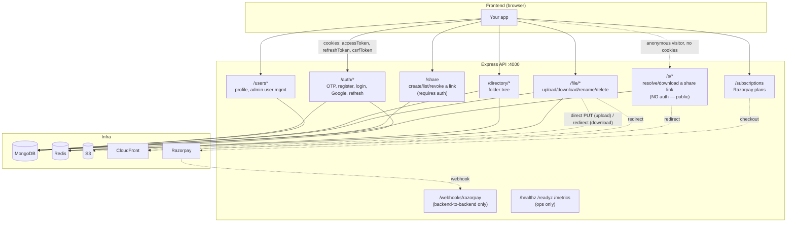
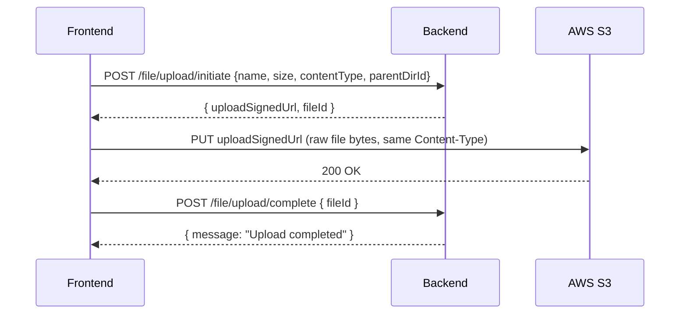

# NeoDrive Backend — Frontend Integration Guide

Everything a frontend needs to integrate with this API from scratch: how the system fits together, the auth/session model, every endpoint with exact request/response payloads, and the recommended build order.

Base URL (local dev): `http://localhost:4000`

---

## 1. System Map



**Mind map (text form, for quick scanning):**

```
NeoDrive API
├── Auth & Session (cookie-based JWT)
│   ├── OTP: send-otp → verify-otp (consumes the OTP, returns a verificationToken)
│   ├── Register (spends the verificationToken, not the raw OTP - auto-login)
│   ├── Login (password)
│   ├── Login with Google (idToken)
│   ├── Refresh (rotates refresh token, silent re-auth)
│   ├── Logout / Logout-all
│   └── Forgot / Reset password
├── User
│   ├── GET /users/me           (any logged-in user)
│   └── Admin-only: list users, force-logout a user, delete a user
├── Directory tree (Google-Drive-style nested folders)
│   ├── GET    — list a folder's contents
│   ├── POST   — create a subfolder
│   ├── PATCH  — rename
│   └── DELETE — delete (recursive)
├── Files
│   ├── Upload = 2 steps: initiate (get S3 presigned URL) → client PUTs to S3 → complete
│   ├── GET    — download/view (redirects to a signed CloudFront URL)
│   ├── PATCH  — rename
│   └── DELETE
├── Sharing (read-only link sharing, file or folder-with-drill-down)
│   ├── /share  (requires auth) — POST create/fetch, GET list mine, DELETE revoke
│   └── /s      (NO auth — this is the one public data endpoint in the whole API)
│       ├── GET :token             — file metadata, or a folder listing (?dirId= to drill down)
│       └── GET :token/file/:fileId — 302 redirect to a signed download URL
├── Subscriptions (Razorpay storage plan upgrades)
└── Ops only (not called by frontend): /healthz, /readyz, /metrics, /webhooks/razorpay
```

---

## 2. Conventions You Must Know Before Writing Any Code

### Response envelope
Every JSON response follows one shape:

```jsonc
// success
{ "success": true, "data": { ... }, "message": "optional human string" }

// error
{ "success": false, "message": "human-readable error", "details": { /* optional, e.g. zod field errors */ } }
```

`data` and `message` are both optional depending on the endpoint (documented per-endpoint below). Some endpoints (delete/logout) return **204 No Content** with an empty body — don't try to parse JSON from those.

### Auth model — cookies, not bearer tokens (for a browser frontend)
On successful login/register/google/refresh, the server sets **three cookies**:

| Cookie | httpOnly | Purpose | Path |
|---|---|---|---|
| `accessToken` | yes | short-lived JWT (15 min), sent automatically by the browser | `/` |
| `refreshToken` | yes | long-lived JWT (30 days), used only to mint new access tokens | `/auth/refresh` only |
| `csrfToken` | **no** (JS-readable) | anti-CSRF token, must be echoed back on mutating requests | `/` |

Because these are cookies, your frontend fetch/axios calls **must** include `credentials: "include"` (fetch) or `withCredentials: true` (axios) on every request, and the frontend origin must exactly match `CLIENT_URL_1`/`CLIENT_URL_2` configured on the backend (CORS is a strict whitelist, not `*`).

There is **no bearer-token mode needed for a browser app** — that path exists only for non-browser clients (mobile/server-to-server) that send `Authorization: Bearer <accessToken>` instead of cookies.

### CSRF — required on every mutating request while cookie-authenticated
Any `POST` / `PATCH` / `PUT` / `DELETE` request made via cookie auth must include the current `csrfToken` cookie's value as a request header:

```
x-csrf-token: <value read from the csrfToken cookie via document.cookie or js-cookie>
```

`GET`/`HEAD`/`OPTIONS` never need it. Requests missing/mismatching it get `403 { message: "Invalid or missing CSRF token" }`. The token rotates on every login/register/google/refresh response — always read the fresh cookie value, don't cache it across sessions.

**Practical pattern:** write one fetch wrapper that (a) always sets `credentials: "include"`, (b) for non-GET requests reads `csrfToken` from `document.cookie` and sets the `x-csrf-token` header automatically. Every API call in your app should go through it.

### Session refresh (silent re-auth)
`accessToken` expires in 15 minutes. When any request comes back `401`, call `POST /auth/refresh` (no body needed — it reads the `refreshToken` cookie automatically) to get a fresh pair, then retry the original request once. If refresh itself fails, redirect to login.

Standard pattern: an axios/fetch response interceptor that on `401` calls refresh once, retries the original request, and only redirects to `/login` if the refresh call *also* fails.

One extra status your interceptor should know about: `409 { message: "Token already refreshed, please retry" }` — this happens if two refresh calls raced (e.g. two tabs refreshing at once); just retry the refresh call once.

### Roles / RBAC
Three roles: `User` (default), `Manager`, `Admin`. Endpoints marked **Admin/Manager** or **Admin only** below return `403` for a plain `User`. There's no self-serve way to become Admin/Manager via the API — that's set directly in the DB.

### Rate limits
| Limiter | Scope | Limit |
|---|---|---|
| Global | every request, per IP | 300 / 15 min |
| Auth | `/auth/*` public endpoints, per IP+email | 10 / 15 min |
| Upload | `/file/upload/initiate`, per user | 60 / min |
| Share create | `POST /share`, per user | 20 / min |
| Share resolve | `/s/*`, per IP (the public surface, so no user id to key on) | 300 / 15 min |
| Directory zip download | `/directory/download`, `/directory/:id/download`, per user | 10 / min |

Exceeding any of these returns `429 { message: "Too many requests, please try again later" }`. Build your OTP/login forms to handle this (disable resend button, show a cooldown message) rather than retry-looping.

### Every response carries a request ID
Response header `X-Request-ID` — worth logging client-side (e.g. attach to error reports) since it's the same ID that appears in backend logs for that request.

---

## 3. Recommended Build Order

Build and test in this order — each step unlocks the data you need for the next:

1. **Health check** — hit `GET /healthz` to confirm you're pointed at a live backend before building anything else.
2. **Auth shell**: send-otp → verify-otp (returns a `verificationToken` — not optional, `register` requires it) → register. This gets you a logged-in session (cookies set) with zero other dependencies. Persist `verificationToken` client-side (it's just a short-lived JWT, not a secret on the level of the session cookies) across the rest of the signup form so a page reload between steps doesn't force the user back through email + a new OTP email.
3. **Login + Google login** — same session outcome, different entry points.
4. **`GET /users/me`** — render the app shell (name/avatar/plan/used-vs-max storage) once logged in.
5. **Directory browsing**: `GET /directory` (no id = root) — build your file-explorer/grid view against this before touching uploads.
6. **File upload flow** (the trickiest one — see §5 dedicated walkthrough) — initiate → direct-to-S3 PUT → complete.
7. **File actions**: download/view link, rename, delete.
8. **Directory actions**: create folder, rename, delete, and download the whole folder as a zip
   (a plain link, not a redirect this time — see §4.3).
9. **Session management UI**: logout, logout-all, forgot/reset password, the silent-refresh interceptor (retrofit this in early, honestly — don't leave it for last).
10. **Sharing** — a "Share" action on a file/folder that calls `POST /share` and shows the returned link (idempotent, so it's safe to call every time the share dialog opens), plus a **separate, fully public route/page** in your app (e.g. `/s/:token`) that calls `GET /s/:token` with no auth at all and renders file metadata or a read-only folder listing. This page must work for a logged-out visitor — don't put it behind whatever auth guard wraps the rest of your app.
11. **Subscriptions** (Razorpay checkout) — needs a Razorpay frontend SDK integration on top of `POST /subscriptions`.
12. **Admin screens** (list users, force-logout, delete user) — only relevant if your frontend has an admin panel; gate these behind the `role` you get back from `/users/me`.

---

## 4. API Reference

Legend: 🔓 public · 🔒 requires session cookie (`requireAuth`) · 🛡️ also requires `x-csrf-token` header · 👑 requires Admin/Manager role · 👑👑 requires Admin only

### 4.1 Auth — `/auth`

#### 🔓 `POST /auth/send-otp`
Rate-limited (auth limiter) + a 60s per-email cooldown enforced server-side.

Request:
```json
{ "email": "jane@example.com" }
```
Response `201`:
```json
{ "success": true, "data": { "message": "OTP sent successfully to jane@example.com" } }
```
Errors: `400` invalid email · `429` cooldown active or rate-limited.

---

#### 🔓 `POST /auth/verify-otp`
**Consumes the OTP** (deletes the record — it cannot be reused) and, on success, issues a
short-lived `verificationToken` (JWT, `purpose: "email_verification"`, ~30 min default) that
`/auth/register` requires in place of the raw OTP. This is what lets a multi-step signup form
survive a page reload: persist `verificationToken` (e.g. in `localStorage`/`redux-persist`) and
resume straight at the "enter your details" step instead of re-sending an OTP email.

Request:
```json
{ "email": "jane@example.com", "otp": "123456" }
```
Response `200`:
```json
{ "success": true, "data": { "verificationToken": "eyJhbGci...", "message": "OTP Verified!" } }
```
Errors: `400` invalid/expired OTP, or too many wrong attempts (max 5, then must request a new
OTP). Because this now consumes the OTP, don't call it twice with the same code — disable your
"verify" button while the request is in flight.

---

#### 🔓 `POST /auth/register`
Spends the `verificationToken` from `/auth/verify-otp` (not the raw OTP — that's already gone).
Creates the user + their root directory, and **logs them in immediately** (sets cookies) — no
separate login call needed after this.

Request:
```json
{
  "name": "Jane Doe",
  "email": "jane@example.com",
  "password": "Str0ng!Pass",
  "verificationToken": "eyJhbGci..."
}
```
Password rules (enforced by zod): 8–72 chars, at least one lowercase, one uppercase, one digit, one special character. `email` must match the `verificationToken`'s embedded email exactly.

Response `201` (also sets `accessToken`/`refreshToken`/`csrfToken` cookies):
```json
{
  "success": true,
  "data": {
    "user": {
      "id": "6a1b...",
      "name": "Jane Doe",
      "email": "jane@example.com",
      "picture": "https://static.vecteezy.com/.../user-profile-icon.jpg",
      "role": "User",
      "maxStorageInBytes": 16106127360
    },
    "message": "Registered and logged in"
  }
}
```
Errors: `400` validation, or an invalid/expired/mismatched `verificationToken` (send the user back
to re-verify their email — `"Invalid or expired verification, please verify your email again"`) ·
`409` email already registered.

---

#### 🔓 `POST /auth/login`
Request:
```json
{ "email": "jane@example.com", "password": "Str0ng!Pass" }
```
Response `200` (sets cookies), same `user` shape as register:
```json
{ "success": true, "data": { "user": { "...": "..." }, "message": "Logged in" } }
```
Errors:
- `401 { message: "Invalid credentials" }` — wrong password (also incremented internally; after 5 failures the account locks for 30 min)
- `403 { message: "Account locked due to too many failed attempts, try again later" }`
- `400 { message: "This account uses Google sign-in, please continue with Google" }` — account has no local password set

---

#### 🔓 `POST /auth/google`
Frontend obtains a Google `idToken` via Google Identity Services, then posts it here. First-time Google sign-in auto-creates the account.

Request:
```json
{ "idToken": "eyJhbGciOi..." }
```
Response `200` (existing user) or `201` (brand-new account), sets cookies:
```json
{
  "success": true,
  "data": {
    "user": { "...": "..." },
    "isNewUser": true,
    "message": "Account created and logged in"
  }
}
```
Errors: `403` — account exists but was soft-deleted by an admin.

---

#### 🔓 `POST /auth/refresh`
No request body — reads the `refreshToken` cookie automatically. Call this reactively (on a `401`) or proactively (e.g. a timer just before the 15-min access token expires).

Response `200` (rotates all three cookies):
```json
{ "success": true, "message": "Token refreshed" }
```
Errors:
- `401 { message: "Invalid or expired session, please log in again" }` — refresh token expired/invalid, or **reuse of an already-rotated token was detected** (all sessions for that user get revoked as a security measure) → redirect to login.
- `409 { message: "Token already refreshed, please retry" }` — benign race between two near-simultaneous refresh calls → just retry once.

---

#### 🔒🛡️ `POST /auth/logout`
No body. Clears cookies, blacklists the current access token, ends this one session/device.

Response: `204 No Content`.

---

#### 🔒🛡️ `POST /auth/logout-all`
No body. Ends **every** session/device for this user (all refresh tokens revoked).

Response: `204 No Content`.

---

#### 🔓 `POST /auth/forgot-password`
Always returns `200` regardless of whether the email exists (anti-enumeration) — don't use the response to tell the user "email not found".

The email sent contains a clickable link — `<CLIENT_URL_1>/auth/reset-password?token=<token>` —
not the bare token. Your reset-password page needs to exist at that exact path and read `token`
from the query string (e.g. `useSearchParams()` in React Router). `CLIENT_URL_1` is a backend env
var (`env.frontend.url`), so if you deploy the frontend somewhere other than what the backend has
configured there, the emailed link will point at the wrong place even though the API itself works
fine — this is a deploy-config issue, not something fixable from the frontend side.

Request:
```json
{ "email": "jane@example.com" }
```
Response `200`:
```json
{ "success": true, "data": { "message": "If an account with that email exists, a reset link has been sent." } }
```

---

#### 🔓 `POST /auth/reset-password`
`token` is the `?token=` query param from the link in the reset email (a purpose-scoped JWT,
valid 15 min) — not something the user types in themselves. Resetting the password force-logs-out
every existing session.

Request:
```json
{ "token": "eyJhbGciOi...", "password": "NewStr0ng!Pass" }
```
Response `200`:
```json
{ "success": true, "data": { "message": "Password has been reset, please log in again" } }
```
Errors: `400` invalid/expired token or weak password.

---

### 4.2 User — `/users`

#### 🔒 `GET /users/me`
Response `200`:
```json
{
  "success": true,
  "data": {
    "name": "Jane Doe",
    "email": "jane@example.com",
    "picture": "https://...",
    "role": "User",
    "maxStorageInBytes": 16106127360,
    "usedStorageInBytes": 4823001
  }
}
```
This is the endpoint for your app-shell header/storage-meter. `usedStorageInBytes` is always live (not cached).

---

#### 🔒👑 `GET /users?page=1&limit=20`
Query params optional, `page` defaults to 1, `limit` defaults to 20 (max 100).

Response `200`:
```json
{
  "success": true,
  "data": {
    "users": [
      { "id": "6a1b...", "name": "Jane Doe", "email": "jane@example.com", "isLoggedIn": true }
    ],
    "pagination": { "page": 1, "limit": 20, "total": 57, "totalPages": 3 }
  }
}
```

---

#### 🔒🛡️👑 `POST /users/:userId/logout`
Force-ends every session for another user (e.g. an admin kicking a compromised account). No body.

Response: `204 No Content`.

---

#### 🔒🛡️👑👑 `DELETE /users/:userId`
Soft-deletes another user (can't delete yourself — `403` if you try). No body.

Response: `204 No Content`.

---

### 4.3 Directory — `/directory`

All directory/file endpoints require the session cookie + CSRF header on mutations (see §2). If you omit the `:id`, the API operates on **your own root directory**.

#### 🔒 `GET /directory` or `GET /directory/:id`
Response `200`:
```json
{
  "success": true,
  "data": {
    "_id": "6a1b...", "id": "6a1b...",
    "name": "root-jane@example.com",
    "size": 4823001,
    "userId": "6a1b...",
    "parentDirId": null,
    "createdAt": "2026-01-01T00:00:00.000Z",
    "updatedAt": "2026-01-10T00:00:00.000Z",
    "files": [
      {
        "_id": "6a2c...", "id": "6a2c...",
        "name": "resume.pdf", "size": 102400, "extension": ".pdf",
        "userId": "6a1b...", "isUploading": false, "parentDirId": "6a1b...",
        "createdAt": "...", "updatedAt": "..."
      }
    ],
    "directories": [
      {
        "_id": "6a3d...", "id": "6a3d...",
        "name": "Photos", "size": 3200000, "userId": "6a1b...",
        "parentDirId": "6a1b...", "createdAt": "...", "updatedAt": "..."
      }
    ],
    "ancestors": [
      { "id": "6a1b...", "name": "root-jane@example.com" },
      { "id": "6a3d...", "name": "Photos" }
    ]
  }
}
```
Note: fields appear twice (`_id` and `id`) — use whichever is more convenient, they're the same value. This response is cached server-side for 45s per directory; you'll never see it stale for longer than that after any write (including up to 45s of a stale name in a descendant's `ancestors` after a rename higher up the tree).

`ancestors` is root-first and does **not** include the directory itself — build a breadcrumb trail as `[...ancestors, {id, name}]` of the current directory. It's empty for the root directory. This is the full, authoritative path — don't try to reconstruct it client-side from navigation history, since that breaks on refresh/back-forward/deep-links.

Errors: `404` — directory doesn't exist or isn't yours.

---

#### 🔒🛡️ `POST /directory` or `POST /directory/:parentDirId`
⚠️ **The folder name is passed as a request header, not a JSON body field.**

```
POST /directory/6a3d...
dirname: My New Folder
x-csrf-token: <...>
```
(No `dirname` header → defaults to `"New Folder"`.)

Response `201`:
```json
{ "success": true, "message": "Directory Created!" }
```
Errors: `404` — parent directory doesn't exist or isn't yours.

---

#### 🔒🛡️ `PATCH /directory/:id`
Request:
```json
{ "newDirName": "Vacation Photos" }
```
Response `200`:
```json
{ "success": true, "message": "Directory Renamed!" }
```

---

#### 🔒🛡️ `DELETE /directory/:id`
Recursively deletes the folder, everything inside it, and their S3 objects (async cleanup). **You cannot delete your own root directory** — the API rejects it.

Response `200`:
```json
{ "success": true, "message": "Files deleted successfully" }
```
Errors: `400 { message: "Cannot delete your root directory" }` · `404` not found/not yours.

---

#### 🔒 `GET /directory/download` and `GET /directory/:id/download`
Downloads the folder (or your root, if `:id` is omitted) and everything nested inside it as a
`.zip`. **Not a JSON endpoint** — unlike every other download in this API, this one isn't a
redirect either; it's a real streamed response body (the API has to actually read every file's
bytes to compress them). Use it as a plain link, same as a file download:

```html
<a href="/directory/6a3d.../download">Download folder</a>
```

Rate-limited tighter than other endpoints (10/min/user) since it's the one path that loads the
API server itself. Rejects with `400` if the folder is empty, has more than 2000 files, or
exceeds 2 GB total — there's no progress indicator or partial-zip fallback, so surface these as a
clear inline message rather than a silent failed download.

Errors: `400` empty folder / over a limit · `404` not found/not yours · `429` rate limited.

---

### 4.4 Files — `/file`

#### The upload flow is two API calls plus one direct upload to S3 — read this before wiring up a file picker.



Your backend **never receives the file bytes** — the browser uploads directly to S3 using the presigned URL. Only steps 1 and 4 hit your API.

---

#### 🔒🛡️ `POST /file/upload/initiate`
Rate-limited: 60/min per user. This is also where storage-quota is enforced (atomically, safe for concurrent uploads).

Request:
```json
{
  "parentDirId": "6a3d...",
  "name": "vacation.jpg",
  "size": 2048000,
  "contentType": "image/jpeg"
}
```
`parentDirId` and `name` are optional (`parentDirId` defaults to your root; `name` defaults to `"untitled"`). `size` (bytes) and `contentType` are required.

Response `201`:
```json
{
  "success": true,
  "data": {
    "uploadSignedUrl": "https://your-bucket.s3.amazonaws.com/6a4e...?X-Amz-...",
    "fileId": "6a4e..."
  }
}
```

Then, **directly to S3** (not your API):
```
PUT <uploadSignedUrl>
Content-Type: image/jpeg   ← must match what you sent as `contentType` above

<raw file bytes>
```

Errors on initiate: `404` parent directory not found · `400` blocked file extension (`.exe`, `.bat`, `.cmd`, `.sh`, `.msi`, `.dll`, `.scr`, `.com`, `.ps1`, `.vbs`, `.jar`) · `507 { message: "Not enough storage." }` quota exceeded.

---

#### 🔒🛡️ `POST /file/upload/complete`
Call this right after the S3 `PUT` succeeds. The backend verifies the uploaded object's actual size against what you declared in `initiate` — if they don't match (or the object isn't found), the file record is deleted and the reserved storage is released.

Request:
```json
{ "fileId": "6a4e..." }
```
Response `200`:
```json
{ "success": true, "data": { "message": "Upload completed" } }
```
Errors: `404` file record not found/not yours, or object never actually landed in S3 · `400 { message: "File size does not match." }`.

**If your UI lets a user abandon an upload** (navigate away before calling `complete`), that reserved storage is auto-corrected by a nightly reconciliation job — it's not permanently lost, just delayed up to 24h in the edge case.

---

#### 🔒 `GET /file/:id` and `GET /file/:id?action=download`
This is **not a JSON endpoint** — it's a `302` redirect to a signed CloudFront URL. Use it as a plain link/navigation, not a `fetch()` call you parse JSON from:

```html
<!-- inline view -->
<a href="/file/6a4e...">View</a>

<!-- forces a download instead of inline display -->
<a href="/file/6a4e...?action=download">Download</a>
```
If you do need to fetch it programmatically (e.g. to show a preview thumbnail), follow the redirect and treat the response as a binary blob, not JSON.

Errors: `404` file not found/not yours.

---

#### 🔒🛡️ `PATCH /file/:id`
Request:
```json
{ "newFilename": "vacation-edited.jpg" }
```
Response `200`:
```json
{ "success": true, "message": "Renamed" }
```

---

#### 🔒🛡️ `DELETE /file/:id`
Response `200`:
```json
{ "success": true, "message": "File Deleted Successfully" }
```

---

### 4.5 Sharing — `/share` (auth) and `/s` (public)

Read-only link sharing for a file or an entire folder (visitors can drill into subfolders,
read-only). This is the only feature split across two very different trust levels: `/share`
manages links and requires the normal session cookie; `/s` resolves them and requires **nothing
at all** — build the `/s/:token` page as a genuinely public route in your app, reachable by a
logged-out visitor, not gated behind whatever wraps the rest of your UI.

#### 🔒🛡️ `POST /share`
Idempotent — calling it again for the same resource while a share is still active returns the
same token/url, not a new one. Safe to call every time your "Share" dialog opens.

Request:
```json
{ "resourceType": "file", "resourceId": "6a4e..." }
```
`resourceType` is `"file"` or `"directory"`. Sharing your own root directory is rejected.

Response `201`:
```json
{
  "success": true,
  "data": {
    "id": "6a5f...",
    "token": "kQ2f9x...",
    "url": "https://your-frontend.example.com/s/kQ2f9x...",
    "resourceType": "file",
    "resourceId": "6a4e...",
    "createdAt": "2026-08-01T12:00:00.000Z"
  }
}
```
`url` is pre-built server-side from the backend's own configured frontend origin + `/s/<token>` —
that exact path (`/s/:token`) needs to exist as a real route in your app for the link to work.

Errors: `400` sharing your own root directory / validation · `404` resource not found or not
yours · `429` rate limited.

---

#### 🔒 `GET /share`
Your active share links, newest first, no pagination. This is the endpoint behind a "manage my
shared links" screen.

Response `200`:
```json
{
  "success": true,
  "data": [
    { "id": "6a5f...", "token": "kQ2f9x...", "url": "https://.../s/kQ2f9x...", "resourceType": "file", "resourceId": "6a4e...", "resourceName": "beach.jpg", "resourceExtension": ".jpg", "createdAt": "..." }
  ]
}
```
`resourceName` (and `resourceExtension`, file shares only — omitted for directory shares) is
looked up live at request time, not stored on the share itself, so it reflects the current
name even if the file/folder was renamed after sharing.

---

#### 🔒🛡️ `DELETE /share/:id`
`:id` is the **share's own id** (from the `data.id` above), not the shared file/folder's id.
Takes effect immediately for browsing and starting any *new* download — the very next
`GET /s/:token` returns `404`, no delay. One caveat worth setting expectations for in your UI: a
download link the visitor **already clicked** before the revoke is a signed CloudFront URL that's
valid on its own terms for a few minutes (`SHARE_DOWNLOAD_URL_EXPIRY_SECONDS`, default 5) —
revoking can't reach into an already-issued URL and kill it early. Don't word your "Turn off link"
confirmation as an instant, absolute guarantee against a download that's already mid-flight.

Response `200`:
```json
{ "success": true, "message": "Share revoked" }
```

---

#### 🔓 `GET /s/:token` and `GET /s/:token?dirId=...`
Public — no cookies sent, no CSRF header needed, works for a logged-out visitor. Returns file
metadata for a file share, or a folder listing for a directory share (`?dirId=` drills into a
subfolder; omit it for the shared folder's own root).

File share response `200`:
```json
{ "success": true, "data": { "resourceType": "file", "file": { "id": "6a4e...", "name": "beach.jpg", "size": 204800, "extension": ".jpg" } } }
```

Directory share response `200`:
```json
{
  "success": true,
  "data": {
    "resourceType": "directory",
    "shareRootId": "6a3d...",
    "directory": { "id": "6a3d...", "name": "Vacation Photos" },
    "files": [ { "id": "6a4e...", "name": "beach.jpg", "size": 204800, "extension": ".jpg" } ],
    "directories": [ { "id": "6a3f...", "name": "Day 2" } ],
    "ancestors": [ ]
  }
}
```
`ancestors` is the breadcrumb trail **cut at the share root** — build your breadcrumbs as
`[...ancestors, {id, name: directory.name}]`, same pattern as the authenticated directory view,
but note this trail never includes anything above the shared folder in the owner's real drive.
Treat the implicit "back to root" affordance (e.g. a Home icon) as "go to the share root," not
the visitor's own drive — visitors don't have one here.

Errors: `404` for every failure — bad/missing/revoked token, or a `dirId` outside the shared
subtree. All return the exact same generic message; don't build any UI logic that tries to
distinguish "revoked" from "never existed" from "wrong folder" — the API deliberately doesn't
tell you which.

---

#### 🔓 `GET /s/:token/file/:fileId?action=download`
Public, same trust level as above. Not a JSON endpoint — a `302` redirect to a signed CloudFront
URL, exactly like `GET /file/:id` (see §4.4) but reachable without a session. `fileId` must be
the shared file itself, or a file living inside the shared folder — anything else is `404`.

```html
<a href="/s/kQ2f9x.../file/6a4e...">View</a>
<a href="/s/kQ2f9x.../file/6a4e...?action=download">Download</a>
```

---

### 4.6 Subscriptions — `/subscriptions`

#### 🔒🛡️ `POST /subscriptions`
Creates a Razorpay subscription for a storage-quota plan. This only creates the subscription server-side and records it as `pending` — you still need to drive the Razorpay Checkout UI on the frontend with the returned `subscriptionId` to actually collect payment. The user's `maxStorageInBytes` only updates once Razorpay fires the `subscription.activated` webhook (asynchronous — poll `GET /users/me` or `GET /directory` afterward to see the new quota reflected).

Request:
```json
{ "planId": "plan_RSgkDvrWdUbK66" }
```
Response `201`:
```json
{ "success": true, "data": { "subscriptionId": "sub_ABC123" } }
```

Known plan IDs → quota (for reference, e.g. to render a pricing table):

| planId | Storage granted |
|---|---|
| `plan_RSgkDvrWdUbK66`, `plan_RSgklpIChuY3bX` | 2 TB |
| `plan_RSg7Nb0DeSPjRx`, `plan_RSg7YdOasAEtld` | 5 TB |
| `plan_RSgl6SqCd64FWT`, `plan_RSglJD8xYAeNQJ` | 10 TB |

---

### 4.7 Not called by the frontend

- `GET /healthz`, `GET /readyz` — liveness/readiness probes (ops/uptime monitoring).
- `GET /metrics` — Prometheus scrape endpoint, token-gated.
- `POST /webhooks/razorpay` — Razorpay calls this directly, signature-verified; your frontend never hits it.

---

## 5. Error Handling Cheat Sheet

| Status | Meaning | What your UI should do |
|---|---|---|
| 400 | Validation failed / bad input | Show `message` (and `details` if present — zod field errors) inline on the form |
| 401 | Not logged in / expired / revoked session | Try `POST /auth/refresh` once, retry the request; if that also fails, redirect to login |
| 403 | Forbidden (RBAC, CSRF, locked account, self-delete guard) | Show the message; don't retry |
| 404 | Resource not found or not yours | Show "not found", don't leak whether it exists for another user |
| 409 | Conflict (duplicate email, or a benign refresh race) | For refresh: silently retry once. For register: tell user the email exists |
| 429 | Rate limited | Show a cooldown/backoff message, don't auto-retry in a loop |
| 507 | Storage quota exceeded | Prompt to upgrade plan / delete files |
| 500 | Unexpected server error | Generic "something went wrong", log the `X-Request-ID` header for support |

---

## 6. Quick Reference Table

| Method | Path | Auth | CSRF | Body/Query |
|---|---|:-:|:-:|---|
| POST | `/auth/send-otp` | 🔓 | – | `{email}` |
| POST | `/auth/verify-otp` | 🔓 | – | `{email, otp}` |
| POST | `/auth/register` | 🔓 | – | `{name, email, password, verificationToken}` |
| POST | `/auth/login` | 🔓 | – | `{email, password}` |
| POST | `/auth/google` | 🔓 | – | `{idToken}` |
| POST | `/auth/refresh` | 🔓* | – | – (cookie only) |
| POST | `/auth/logout` | 🔒 | 🛡️ | – |
| POST | `/auth/logout-all` | 🔒 | 🛡️ | – |
| POST | `/auth/forgot-password` | 🔓 | – | `{email}` |
| POST | `/auth/reset-password` | 🔓 | – | `{token, password}` |
| GET | `/users/me` | 🔒 | – | – |
| GET | `/users?page&limit` | 🔒👑 | – | query |
| POST | `/users/:userId/logout` | 🔒👑 | 🛡️ | – |
| DELETE | `/users/:userId` | 🔒👑👑 | 🛡️ | – |
| GET | `/directory/:id?` | 🔒 | – | – |
| POST | `/directory/:parentDirId?` | 🔒 | 🛡️ | header `dirname` |
| PATCH | `/directory/:id` | 🔒 | 🛡️ | `{newDirName}` |
| DELETE | `/directory/:id` | 🔒 | 🛡️ | – |
| GET | `/directory/download` or `/directory/:id/download` | 🔒 | – | streams a zip |
| POST | `/file/upload/initiate` | 🔒 | 🛡️ | `{parentDirId?, name?, size, contentType}` |
| POST | `/file/upload/complete` | 🔒 | 🛡️ | `{fileId}` |
| GET | `/file/:id?action=` | 🔒 | – | redirects |
| PATCH | `/file/:id` | 🔒 | 🛡️ | `{newFilename}` |
| DELETE | `/file/:id` | 🔒 | 🛡️ | – |
| POST | `/share` | 🔒 | 🛡️ | `{resourceType, resourceId}` |
| GET | `/share` | 🔒 | – | – |
| DELETE | `/share/:id` | 🔒 | 🛡️ | – |
| GET | `/s/:token?dirId=` | 🔓 | – | – |
| GET | `/s/:token/file/:fileId?action=` | 🔓 | – | redirects |
| POST | `/subscriptions` | 🔒 | 🛡️ | `{planId}` |

\* `/auth/refresh` requires the `refreshToken` cookie to be present, but doesn't go through `requireAuth` (which checks the access token).
