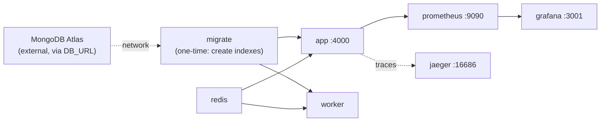

# Installation

The backend — API, background worker, Redis, and the observability stack (Prometheus, Grafana,
Jaeger) — runs as one Docker Compose project. MongoDB is not part of that stack: the app connects
to a MongoDB Atlas cluster over the network via `DB_URL`. This is the fastest way to get a fully
working instance with nothing installed locally except Docker.

> Doing active backend development instead (hot reload on save)? See
> **[local-dev-troubleshooting.md](./local-dev-troubleshooting.md)** for running natively on the
> host with `npm run dev`/`worker:dev`.

## Prerequisites

- [Docker Desktop](https://www.docker.com/products/docker-desktop/) installed and running
- A [MongoDB Atlas](https://www.mongodb.com/cloud/atlas) cluster (or any Mongo replica set
  reachable over the network) and its connection string for `DB_URL`
- An AWS S3 bucket + CloudFront distribution (for file storage) — see the main
  [README.md](../README.md) for what each `.env` variable needs
- A [Resend](https://resend.com) account (for OTP/password-reset emails) and a
  [Razorpay](https://razorpay.com) account (for subscription billing), if you need those features

## 1. Configure environment

```bash
cd backend
cp .env.example .env
```

Fill in `.env` with real values. At minimum, for the app to start at all you need `DB_URL` set to
your MongoDB Atlas connection string (e.g.
`mongodb+srv://<user>:<password>@<cluster-host>/storage-app?retryWrites=true&w=majority`) and
`REDIS_URL` left as its default (Docker Compose overrides it to point at its own `redis` container
automatically — see `docker-compose.yml`), plus JWT/CSRF secrets set to something random.
Everything else (AWS, Resend, Razorpay, Google OAuth) can stay blank for a local smoke test — those
features will just no-op or 4xx until configured, they won't crash the app.

`RESEND_FROM_ADDRESS` defaults to `onboarding@resend.dev`, Resend's built-in sandbox address —
it works immediately with no domain setup, but can only deliver to the email address your Resend
account itself is registered with. To send to real users, verify your own domain under Resend's
**Domains** tab and change this to `you@yourdomain.com`.

## 2. Start everything

```bash
npm run docker:up      # first run, or after changing backend code - rebuilds the image
npm run docker:start   # every run after that - skips the rebuild, starts in ~2s
```

This is `docker compose up --build -d` under the hood. It builds the app image once and reuses it
for both the API and worker containers, then brings everything up in the right order:



`migrate` is a one-shot container (`restart: "no"`) — it runs once, exits successfully, and
`app`/`worker` wait on that success (`depends_on: condition: service_completed_successfully`)
before starting. You'll see it exit in `docker compose ps`; that's expected, not a crash. It
connects straight to Atlas using the `DB_URL` from `.env`, so there's no local Mongo container to
wait on first.

## 3. Verify it's up

| Service       | URL                           | What you should see                                                                         |
| ------------- | ----------------------------- | ------------------------------------------------------------------------------------------- |
| API           | http://localhost:4000/healthz | `{"status":"ok"}`                                                                         |
| API readiness | http://localhost:4000/readyz  | `{"status":"ok"}` (fails until Mongo Atlas/Redis are actually reachable)                  |
| Prometheus    | http://localhost:9090         | Prometheus UI; check**Status → Targets** shows `app` as `UP`                     |
| Grafana       | http://localhost:3001         | Pre-provisioned "NeoDrive Backend - Overview" dashboard (anonymous viewer access, no login needed) |
| Jaeger        | http://localhost:16686        | Select service`neodrive-backend` to see traces once you've hit a few API routes        |

```bash
npm run docker:logs   # tail app + worker logs
npm run docker:ps     # see container status
npm run docker:down   # stop everything
```

## Updating after a code change

`docker compose up --build` (or `npm run docker:up` again) rebuilds the image and recreates only
the containers whose image actually changed — Mongo/Redis/Prometheus/Grafana/Jaeger data volumes
are untouched.

## Common issues

See the **Common errors and fixes** table in
[local-dev-troubleshooting.md](./local-dev-troubleshooting.md) — most of those (Docker Desktop not
running, CloudFront scheme errors, `.env` not reloading) apply here too. Mongo-replica-set errors
(`ReplicaSetNoPrimary`, `getaddrinfo ENOTFOUND mongo`, etc.) don't apply to this setup since
`DB_URL` points at MongoDB Atlas, not a container on the Docker network — if you see one, it means
`DB_URL` in `.env` is wrong or the Atlas cluster isn't reachable (check IP access list/network
egress), not a replica-set initialization problem.
