# NeoDrive Frontend

React 19 + Redux Toolkit/RTK Query client for the NeoDrive API (`../backend`) — file/folder
storage with cookie-based auth, direct-to-S3 uploads, CloudFront-signed downloads, folder-as-zip
downloads, read-only link sharing (a Share action + a "Shared Links" management page, plus a
chromeless public `/s/:token` page for anyone with a link), and Razorpay subscriptions.

**Looking for how a specific part of this app actually works?** See
**[docs/](./docs/index.md)** — auth/session handling, routing, state management, the file upload
flow, sharing, analytics, styling, environment variables, and build/deploy, all verified against
the real code (not the generic template this project started from).

**New to this codebase?** Jump to **[Flow Diagrams](#flow-diagrams)** below — rendered inline,
click any section to expand — or read the prose version with a full config/timeouts cheat-sheet
at [docs/flow-diagrams.md](./docs/flow-diagrams.md).

## Stack

- **React 19** with Redux Toolkit + RTK Query (server state lives entirely in the RTK Query
  cache — see [docs/state-and-api.md](./docs/state-and-api.md))
- **React Router v7**, every page lazy-loaded (see [docs/routing-and-pages.md](./docs/routing-and-pages.md))
- **Cookie-based auth** — both JWTs are httpOnly cookies the frontend never reads; only a
  JS-visible CSRF cookie is used, mirrored into a request header on mutations (see
  [docs/authentication.md](./docs/authentication.md))
- **Tailwind CSS v4** (CSS-first `@theme` config, no `tailwind.config.js`) + a from-scratch UI
  component library (no external UI kit) + framer-motion (see [docs/styling.md](./docs/styling.md))
- **Vite** for dev/build; production deploys as a static site on **S3 + CloudFront** with a
  custom domain and ACM-issued TLS (see
  [docs/s3-cloudfront-deployment.md](./docs/s3-cloudfront-deployment.md)); Docker + nginx also
  available for local/alternative container-based serving (see
  [docs/build-and-deploy.md](./docs/build-and-deploy.md))

## Setup

```bash
npm install
cp .env.example .env.local   # fill in VITE_API_BASE_URL etc. — see docs/environment-variables.md
npm run dev                   # http://localhost:5173
```

The backend must be running first (`../backend`, default `http://localhost:4000`) — see
[../backend/docs/installation.md](../backend/docs/installation.md) or
[../backend/README.md](../backend/README.md) to get it up via Docker.

## Scripts

| Script | Purpose |
|---|---|
| `npm run dev` | Dev server with HMR, `:5173` |
| `npm run build` | Production build → `dist/` |
| `npm run preview` | Serve the production build locally |
| `npm run lint` / `npm run lint:fix` | ESLint |

## Full documentation

| Doc | What's in it |
|---|---|
| [docs/architecture.md](./docs/architecture.md) | Folder map, render/bootstrap lifecycle, the patterns used throughout |
| [docs/flow-diagrams.md](./docs/flow-diagrams.md) | Visual reference: bootstrap, Redux/RTK Query store, every auth flow, routing, upload, caching, analytics, config cheat-sheet |
| [docs/authentication.md](./docs/authentication.md) | Cookie session bootstrap, login/register/Google, CSRF, token refresh, idle timeout, background session revalidation |
| [docs/routing-and-pages.md](./docs/routing-and-pages.md) | Full route tree, `AuthGuard` rules, role-gating, every page |
| [docs/state-and-api.md](./docs/state-and-api.md) | Redux/RTK Query setup, the 6 API slices, error handling, two real bugs worth knowing about |
| [docs/file-management.md](./docs/file-management.md) | The Drive page: two-phase upload with progress, preview, rename/delete |
| [docs/sharing.md](./docs/sharing.md) | The owner's Share action on the Drive page, and the public, unauthenticated `/s/:token` page anyone with a link lands on |
| [docs/analytics.md](./docs/analytics.md) | The multi-provider analytics module, event catalog, and a real gap (tracking isn't called anywhere yet) |
| [docs/styling.md](./docs/styling.md) | Tailwind design tokens, the UI component library, motion primitives |
| [docs/environment-variables.md](./docs/environment-variables.md) | Every `VITE_*` var — including two that are wired but not actually read |
| [docs/build-and-deploy.md](./docs/build-and-deploy.md) | Vite build/chunking, Docker multi-stage build, `nginx.conf`, CSP, how the two repo-root GitHub Actions workflows avoid triggering each other |
| [docs/s3-cloudfront-deployment.md](./docs/s3-cloudfront-deployment.md) | Production deployment: S3 (private, OAC) + CloudFront + ACM SSL + GitHub Actions CI/CD |
| [docs/contributing.md](./docs/contributing.md) | Real conventions used in this codebase — how to add an endpoint/page, state rules, what not to do |

This app is the client half of a two-part system — see
**[../backend/docs/index.md](../backend/docs/index.md)** for the API it talks to (every request
payload, the auth/CSRF model from the server side, and the EC2/Docker/nginx production deployment
guide for the backend).

## Flow Diagrams

Click a section to expand. Full prose + a one-page config/timeouts cheat-sheet:
[docs/flow-diagrams.md](./docs/flow-diagrams.md). Polished standalone version (same diagrams,
sidebar navigation): [Artifact ↗](https://claude.ai/code/artifact/1482b2f2-a52d-410f-a2eb-e3ff7a039c15).

<details>
<summary><strong>1. System overview</strong></summary>

The frontend never proxies file bytes through the backend — uploads go straight to S3, downloads
redirect straight to CloudFront. Auth tokens are httpOnly cookies; only `auth.user` and
`registration` (signup progress) ever reach `localStorage`.

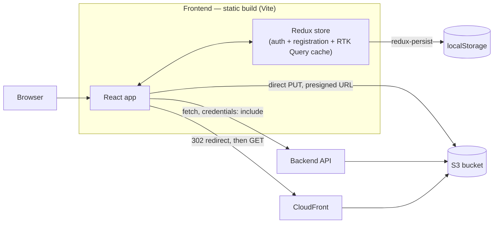

</details>

<details>
<summary><strong>2. App bootstrap / render lifecycle</strong></summary>

The persisted-`user` check in `bootstrapAuth()` is why a brand-new or already-logged-out visitor
makes zero auth network calls on load.

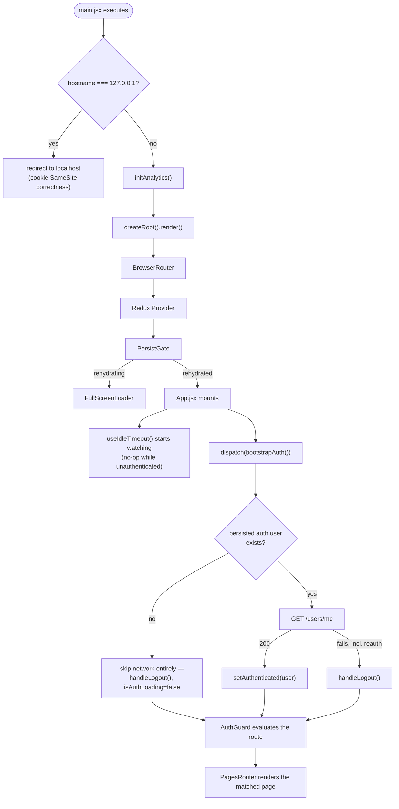

</details>

<details>
<summary><strong>3. Redux store & RTK Query architecture</strong></summary>

One `createApi()` instance, five feature files injecting into it — not five separate APIs. That's
why they all share one cache, one tag list, and the same reauth logic.

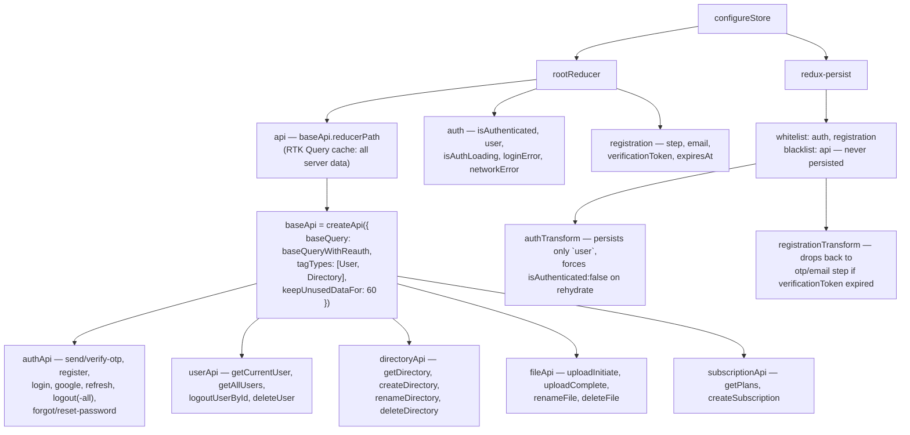

</details>

<details>
<summary><strong>4. Auth — login</strong></summary>

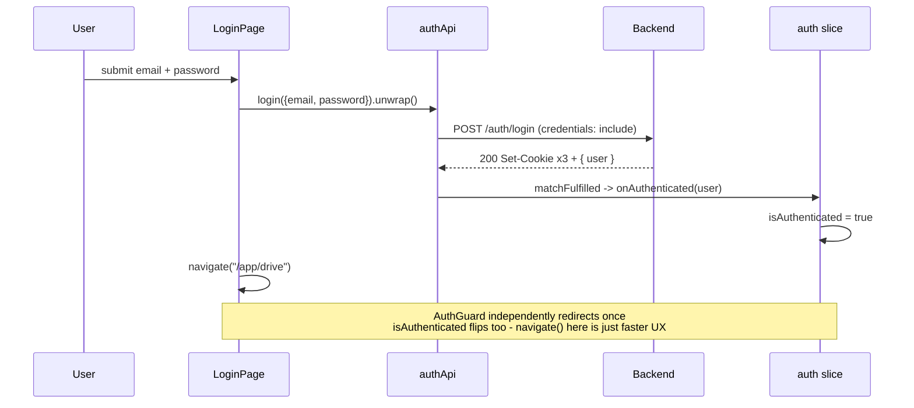

</details>

<details>
<summary><strong>5. Auth — registration (3-step, survives a reload)</strong></summary>

Only `step`/`email`/`verificationToken` are persisted — never the password, never the raw OTP.

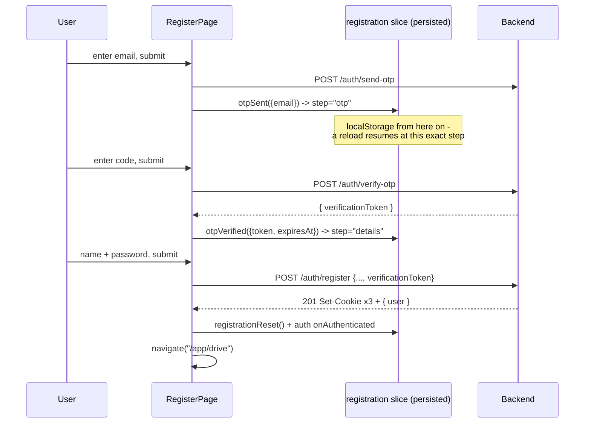

</details>

<details>
<summary><strong>6. Auth — token refresh & reauth (client-side)</strong></summary>

The post-acquire "did someone else already refresh" check and the 409-as-success handling are
both fixes for a real race that used to cause a burst of redundant refresh calls.

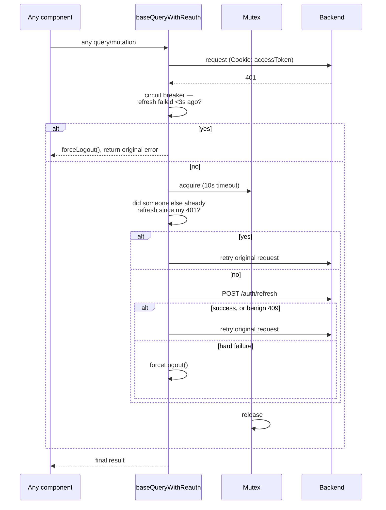

</details>

<details>
<summary><strong>7. Auth — logout & background session guard</strong></summary>

```mermaid
sequenceDiagram
    participant Guard as useSessionGuard (in AppLayout)
    participant RTK as userApi
    participant API as Backend
    participant Store as auth slice

    loop every 60s while authenticated, plus on focus/reconnect
        Guard->>RTK: getCurrentUser
        RTK->>API: GET /users/me
        alt success
            API-->>RTK: 200 { user }
            RTK-->>Guard: dispatch(setUser(data))
        else error — session genuinely gone
            Note over RTK,API: baseQuery already tried its own<br/>reauth first; this only fires after that failed too
            Guard->>Store: dispatch(logoutUser()) — no navigate()
            Note over Guard: AuthGuard alone reacts to isAuthenticated=false.<br/>An earlier version called navigate() here directly,<br/>which raced ahead of the state flip and caused<br/>a login<->drive bounce loop - fixed by removing it
        end
    end
```

</details>

<details>
<summary><strong>8. Routing — AuthGuard decision tree</strong></summary>

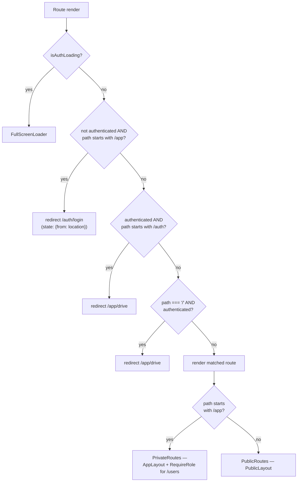

</details>

<details>
<summary><strong>9. File upload — two-phase commit (client side)</strong></summary>

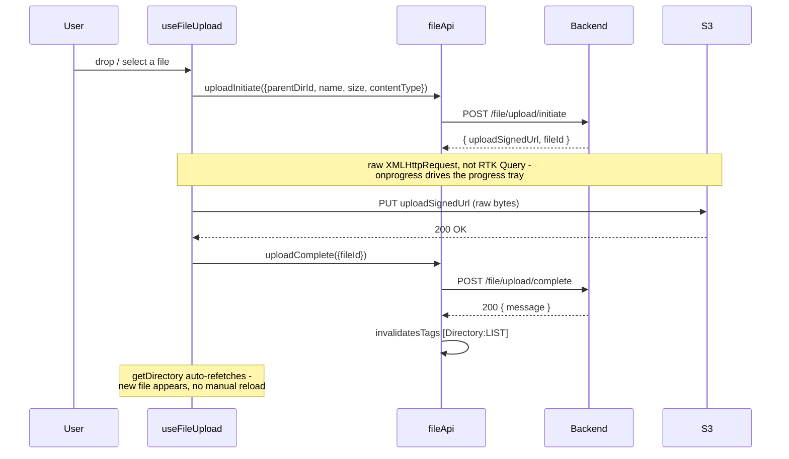

</details>

<details>
<summary><strong>10. Directory browsing & cache invalidation</strong></summary>

The breadcrumb trail is never reconstructed client-side — it comes straight from the API's
`ancestors[]` on every response, so back/forward/refresh/deep-links all just work.

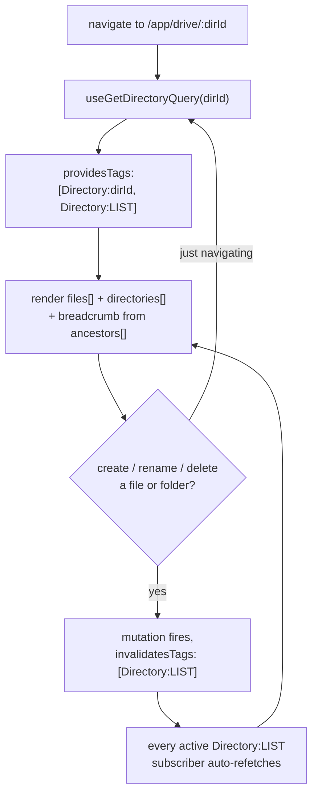

</details>

<details>
<summary><strong>10b. Sharing — owner creates a link, an anonymous visitor opens it</strong></summary>

`ShareModal` calls `createShare` on every open (idempotent server-side, so no client-side "is
this already shared" tracking needed). `ShareView` is a chromeless public page at `/s/:token`,
reachable with no session at all.

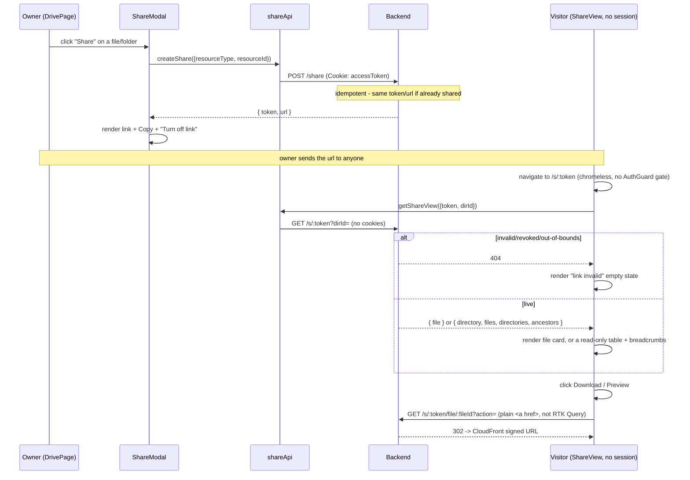

</details>

<details>
<summary><strong>11. Analytics</strong></summary>

`track()`/`identify()` exist via `useAnalytics()` but have no call sites anywhere yet — only
automatic page views actually fire.

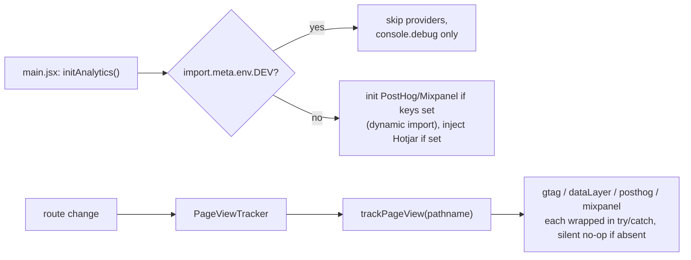

</details>

Full config/timeouts cheat-sheet (idle timeout, session-guard poll, mutex/circuit-breaker
windows, RTK Query cache retention, and the two `VITE_*` vars that look wired but aren't):
[docs/flow-diagrams.md#12-config--timeouts-cheat-sheet](./docs/flow-diagrams.md#12-config--timeouts-cheat-sheet).
