# Flow Diagrams

Visual reference for how this frontend actually works — app bootstrap, the Redux/RTK Query
store, every auth flow, routing, file upload, cache invalidation, and analytics. This doc is
diagram-first; for full detail follow the links out to the relevant deep-dive doc. A rendered
version of this same content is also published as an Artifact, and the same diagrams are embedded
directly in [../README.md](../README.md) as collapsible sections.

Every diagram here was checked directly against the source it describes: `src/main.jsx`,
`src/App.jsx`, `src/store/index.js`, `src/store/rootReducer.js`, `src/store/persist/index.js`,
`src/store/api/baseApi.js`, `src/store/api/baseQuery.js`, `src/store/api/features/*.js`,
`src/store/slices/auth-slice/*`, `src/store/slices/registrationSlice.js`,
`src/components/common/Guard/index.jsx`, `src/hooks/{useSessionGuard,useIdleTimeout}.js`,
`src/pages/app/drive/*`, `src/pages/public/ShareView/*`, `src/analytics/*`.

---

## 1. System overview

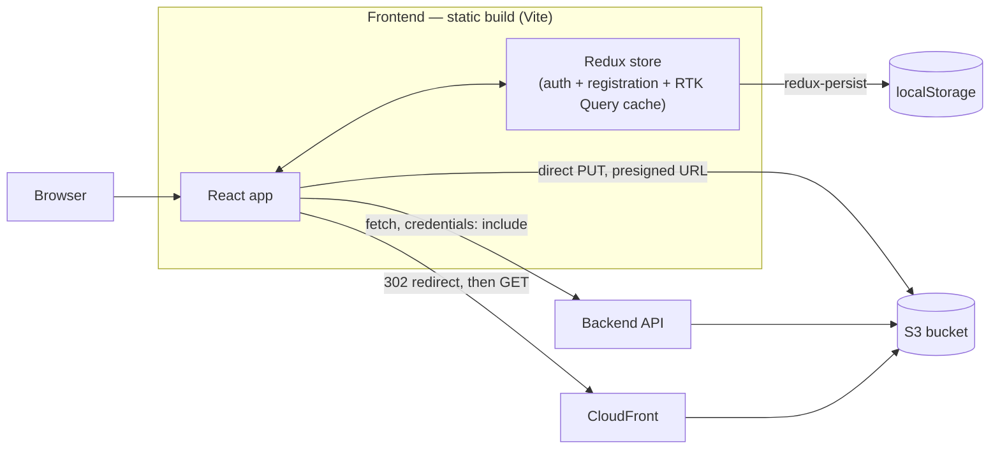

The frontend never talks to S3/CloudFront through the backend for the actual file bytes — see
[file-management.md](./file-management.md). Auth tokens are httpOnly cookies the browser manages
automatically; only `auth.user` (profile) and `registration` (signup progress) ever reach
`localStorage` — see [authentication.md](./authentication.md).

---

## 2. App bootstrap / render lifecycle

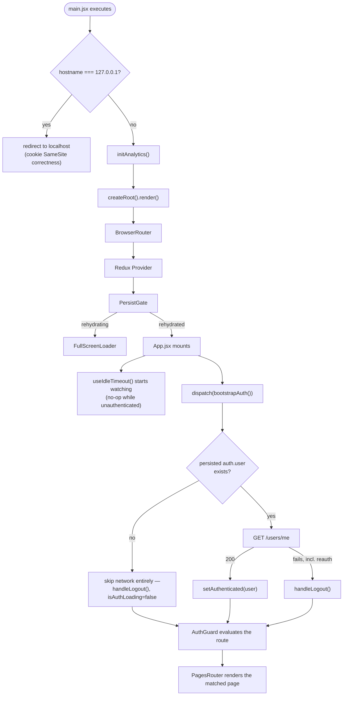

The persisted-`user` check in `bootstrapAuth()` is why a brand-new or already-logged-out visitor
makes **zero** auth network calls on load — see
[authentication.md](./authentication.md#boot-sequence).

---

## 3. Redux store & RTK Query architecture

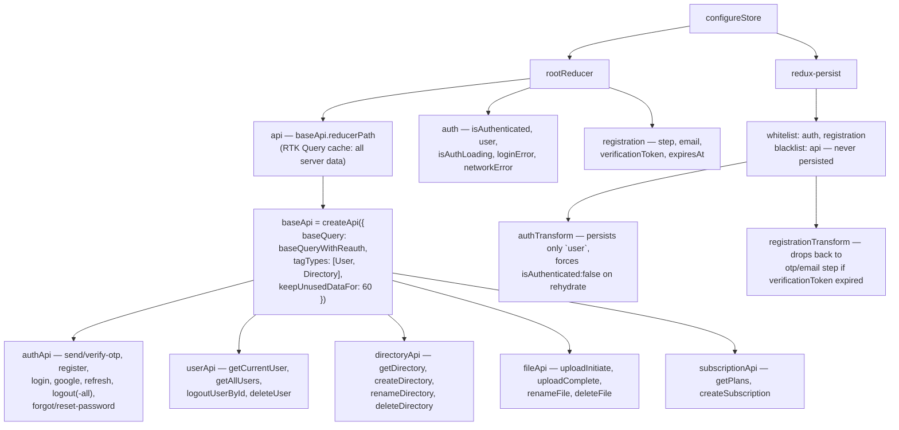

One `createApi()` instance, five feature files injecting into it — not five separate APIs. That's
why they all share one cache, one tag list, and the same reauth logic. See
[state-and-api.md](./state-and-api.md).

---

## 4. Auth — login

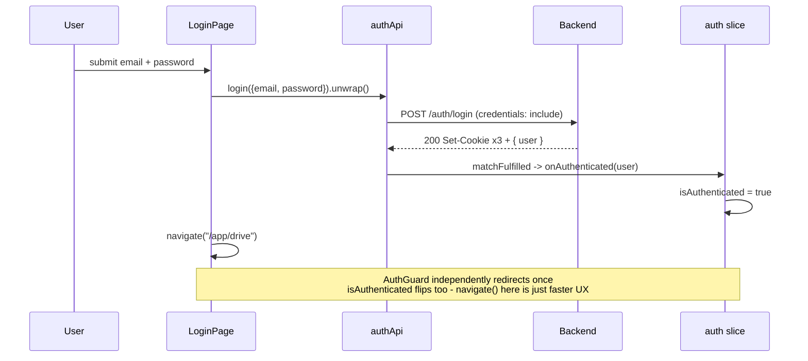

---

## 5. Auth — registration (3-step, survives a reload)

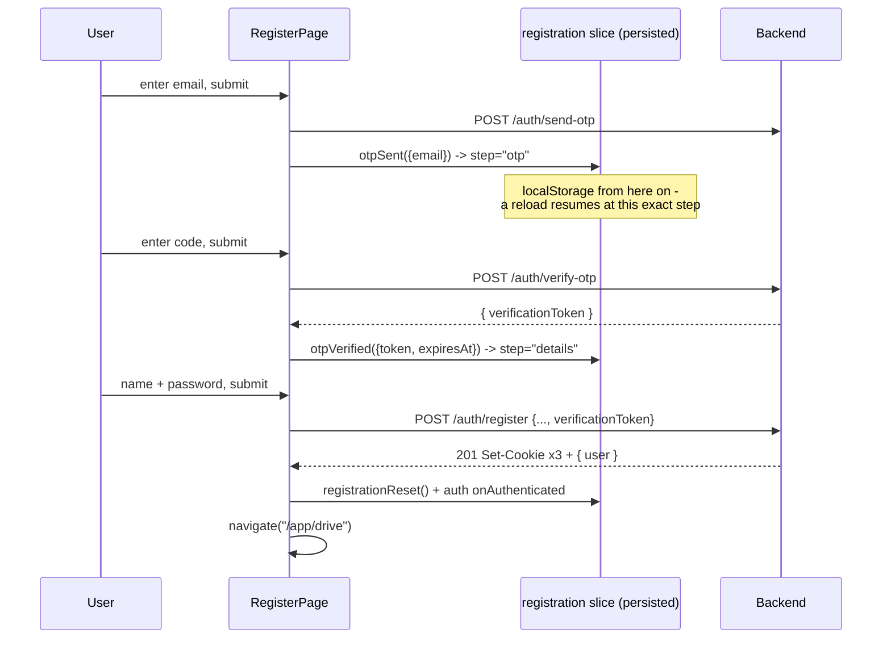

Only `step`/`email`/`verificationToken` are persisted — never the password, never the raw OTP.
Full detail: [authentication.md](./authentication.md#register-persisted-across-reloads).

---

## 6. Auth — token refresh & reauth (client-side)

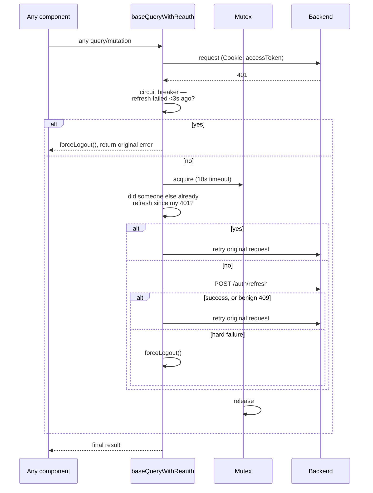

The post-acquire "did someone else already refresh" check and the 409-as-success handling are
both fixes for a real race that used to cause a burst of redundant refresh calls — see
[authentication.md](./authentication.md#token-refresh-transparent-mutex-guarded).

---

## 7. Auth — logout & background session guard

```mermaid
sequenceDiagram
    participant Guard as useSessionGuard (in AppLayout)
    participant RTK as userApi
    participant API as Backend
    participant Store as auth slice

    loop every 60s while authenticated, plus on focus/reconnect
        Guard->>RTK: getCurrentUser
        RTK->>API: GET /users/me
        alt success
            API-->>RTK: 200 { user }
            RTK-->>Guard: dispatch(setUser(data))
        else error — session genuinely gone
            Note over RTK,API: baseQuery already tried its own<br/>reauth first; this only fires after that failed too
            Guard->>Store: dispatch(logoutUser()) — no navigate()
            Note over Guard: AuthGuard alone reacts to isAuthenticated=false.<br/>An earlier version called navigate() here directly,<br/>which raced ahead of the state flip and caused<br/>a login<->drive bounce loop - fixed by removing it
        end
    end
```

---

## 8. Routing — `AuthGuard` decision tree

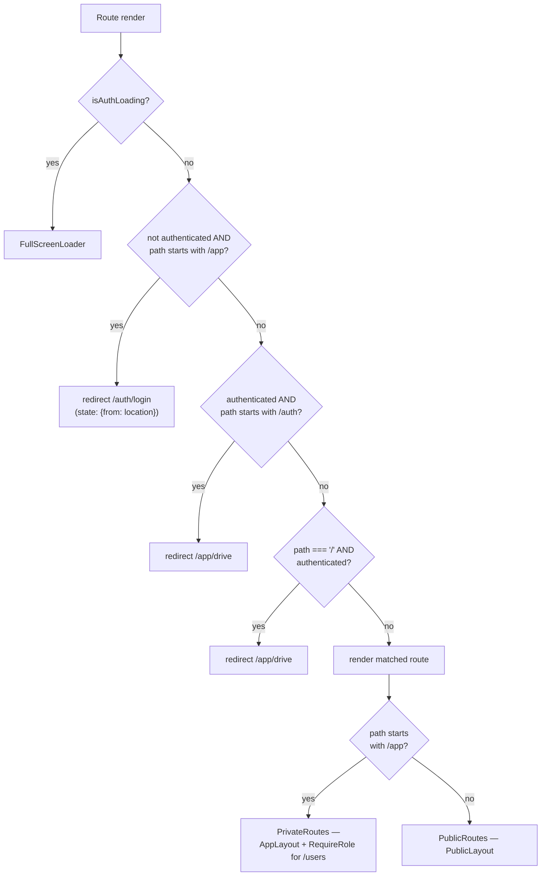

See [routing-and-pages.md](./routing-and-pages.md) for the full route table and every page.

---

## 9. File upload — two-phase commit (client side)

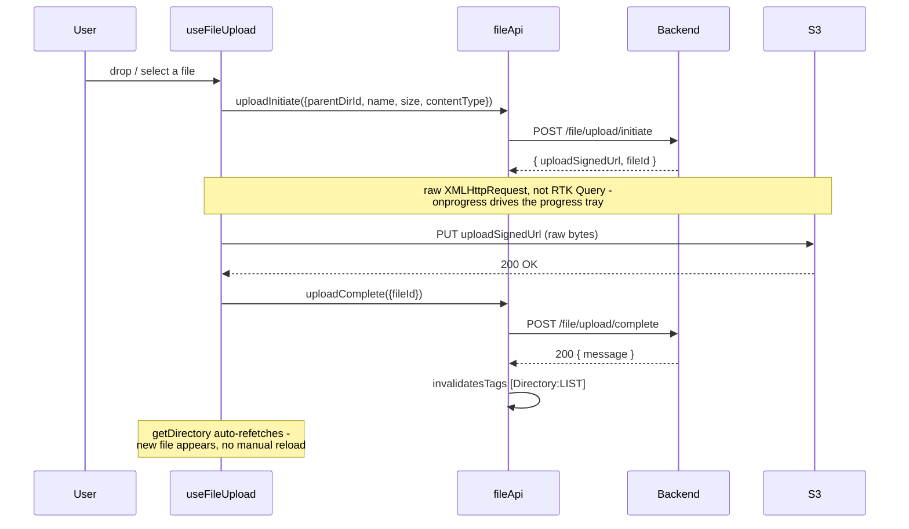

---

## 10. Directory browsing & cache invalidation

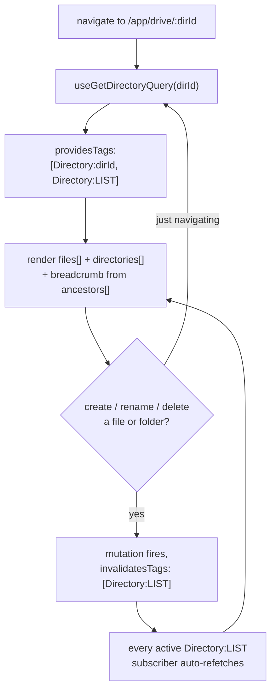

The breadcrumb trail is never reconstructed client-side — it comes straight from the API's
`ancestors[]` on every response, so back/forward/refresh/deep-links all just work. See
[file-management.md](./file-management.md).

---

## 10b. Sharing — owner creates a link, an anonymous visitor opens it

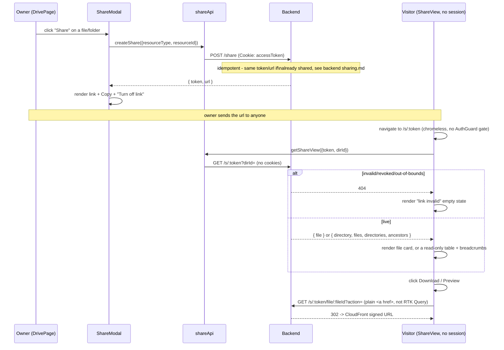

`ShareModal` calls `createShare` on every open, not just once — it relies entirely on the
backend's idempotency rather than tracking "is this already shared" client-side. `ShareView`'s
`?dirId=` navigation is query-string based, unlike `DrivePage`'s path-param style — see
[sharing.md](./sharing.md) for why.

---

## 11. Analytics

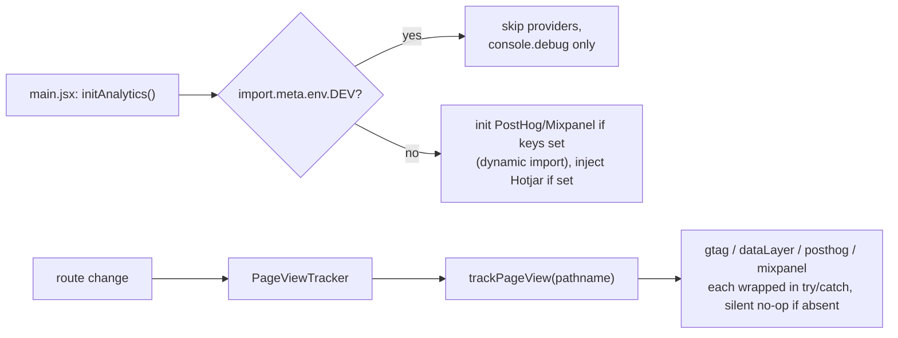

`track()`/`identify()` exist via `useAnalytics()` but have **no call sites** anywhere yet — only
automatic page views actually fire. See [analytics.md](./analytics.md#the-event-catalog-analyticseventsjs--a-real-gap).

---

## 12. Config & timeouts cheat-sheet

| What | Value | Source |
|---|---|---|
| Idle logout timeout | 30m | `AUTH_CONFIG.sessionTimeout` (hardcoded — `VITE_SESSION_TIMEOUT` isn't actually read) |
| Background session-guard poll | 60s | `useSessionGuard.js` `POLL_INTERVAL` |
| Refresh mutex acquire timeout | 10s | `baseQuery.js` `MUTEX_TIMEOUT_MS` |
| Refresh-failure circuit breaker | 3s | `baseQuery.js` `REFRESH_FAILURE_COOLDOWN_MS` |
| RTK Query unused-cache retention | 60s | `baseApi.js` `keepUnusedDataFor` |
| API request timeout | 30s | `apiConfig.js` `API_CONFIG.timeout` |
| Email-verification token (persisted) | 30m | mirrors the backend's `EMAIL_VERIFICATION_TOKEN_EXPIRY` |
| Drive view-mode preference | indefinite | plain `localStorage`, key `drive-view-mode` (not Redux) |
| Share link lifetime | none — revoke-only, no expiry (v1) | see [sharing.md](./sharing.md) |
| Vite dev server | `:5173` | `vite.config.js` |
| Razorpay key used at checkout | **hardcoded test key**, not `VITE_RAZORPAY_KEY_ID` | known gap, see [environment-variables.md](./environment-variables.md#vars-that-look-wired-but-arent) |

See [environment-variables.md](./environment-variables.md) for every `VITE_*` var and which of
them are actually wired up.
